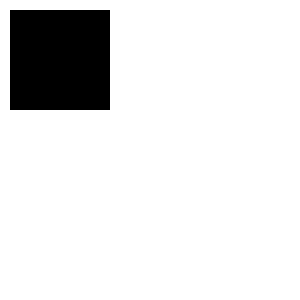

# El elemento `<canvas>`{.html}

---


## `<canvas>`{.html}

- Introducido en HTML5
- Nos permite pintar gráficos 2D o 3D usando JavaScript

```html
<canvas width="320" height="200"></canvas>
```

---


## Escalado

Las dimensiones del canvas no tienen por qué corresponderse con las dimensiones en pantalla

```css
canvas {
    width: 640px;
    height: 480px;
}
```

<small>Podemos usar esto a nuestro favor y jugar con los escalados, o adaptar nuestro juego a distintos tamaños de pantalla. Ejemplo: [Retro, crisp pixel art in HTML5 games](https://belenalbeza.com/retro-crisp-pixel-art-in-html-5-games/)</small>

---


## Contextos

Para hacer cualquier operación de pintado, necesitamos el **contexto** de un `<canvas>`{.html}

Lo obtenemos con `getContext`{.js}, al que debemos indicar si lo queremos 2D o 3D

```js
var c = document.querySelector('canvas').getContext('2d');
```

---

## Canvas API


- Es la API de dibujo 2D en canvas
- Permite pintar imágenes, manipular píxeles, dibujar primitivas, curvas, etc
- [Documentación en la MDN](https://developer.mozilla.org/en-US/docs/Web/API/Canvas_API)
-  [Canvas Deep Dive](http://joshondesign.com/p/books/canvasdeepdive/toc.html) (libro online conciso, pero bastante completo)

---

## Ejemplo

```javascript
var ctx = document.querySelector('canvas').getContext('2d');
ctx.fillRect(10, 10, 100, 100);
```

---



<small>[Snippet de código](https://jsfiddle.net/nea366Lm/) online.</small>

---


## Colores, bordes, etc

- Es similar a cómo funciona un programa de dibujo
- En el **contexto** indicamos los estilos que queremos que las "herramientas" (operaciones) usen
- ¡Ojo que hay que "deshacer"!


## Ejemplo

```javascript
// red rectangles
ctx.fillStyle = '#FF004D';
ctx.fillRect(10, 10, 100, 100);
ctx.fillRect(190, 10, 100, 100);
// blue rect with white border
ctx.fillStyle = 'rgba(41, 173, 255, 0.8)';
ctx.fillRect(50, 50, 100, 100);
ctx.strokeStyle = '#fff';
ctx.lineWidth = 5;
ctx.strokeRect(50, 50, 100, 100);
```

---


<small>[Snippet de código](https://jsfiddle.net/x8knv6w3/2/) online.</small>

---

## Imágenes

- Las imágenes deben estar **ya cargadas** (por ejemplo con ``{.html}) para poder pintarlas
- Podemos obtener _sources_ de imágenes de otros medios: la webcam del usuario, un `<video>`{.html}, otro `<canvas>`{.html}, etc

---

```html

<canvas width="300" height="300"></canvas>
```

```javascript
var img = document.getElementById('kitten');
var ctx = document.querySelector('canvas')
    .getContext('2d');

ctx.drawImage(img, 0, 0);
```

---


<small>[Snippet de código](https://jsfiddle.net/j4hbb46h/1/) online</small>


## Cargar imágenes al vuelo

Podemos cargar imágenes al vuelo **desde JavaScript**

1. Usamos el constructor **`Image`{.js}**
2. Nos subscribimos al evento de **`load`{.js}** (para pintar la imagen cuando se haya producido)
3. Establecemos el atributo **`src`{.html}** de la imagen para iniciar la carga

---

```javascript
var img = new Image();
img.addEventListener('load', function () {
	ctx.drawImage(img, 0, 0);
});
img.src = 'https://placekitten.com/g/300/300';
```

<small>[Snippet de código](https://jsfiddle.net/Lm56dcb6/) online</small>

---

## Sobre la carga de imágenes

- Las ``{.html} con el estilo `display:none`{.html} se siguen cargando igualmente
- `window.onload`{.js} se dispara cuando las imágenes creadas con ``{.html} se han cargado
- Para precargar varias imágenes, se suelen utilizar [Promesas](https://developer.mozilla.org/en/docs/Web/JavaScript/Reference/Global_Objects/Promise), o bien un contador para detectar cuándo se han cargado todas

---

## Qué más se puede hacer con la API

- Dibujar curvas y paths complejos
- Pintar gradientes
- Clipping
- Transformaciones
- Manipular píxeles
- ¡Y más!

---


## WebGL


- Implementación en JavaScript de OpenGL ES 2.0
- Es una API estándar de gráficos 3D
- [Documentación MDN](https://developer.mozilla.org/en-US/docs/Web/API/WebGL_API)
- Para pedir un contexto 3D a `<canvas>`{.html} debemos especificar **`webgl`{.js}**<sup>1</sup> en `getContext`{.js}

<small>1. O `experimental-webgl`{.html} en algunos navegadores.</small>


## ¿Gráficos 2D en WebGL?

- Podemos dibujar gráficos 2D usando una API 3D como WebGL
- El "truco" es utilizar una proyección ortográfica, que no deforme los objetos con perspectiva


## Recursos

- _Introduction to WebGL_ [parte 1](https://dev.opera.com/articles/introduction-to-webgl-part-1/) y [parte 2](https://dev.opera.com/articles/introduction-to-webgl-part-2-porting-3d/)
- [WebGL fundamentals](http://webglfundamentals.org/): tutoriales paso a paso


# Librerías


## 2D: Pixi.js

- [www.pixijs.com](http://www.pixijs.com/)
- Renderiza gráficos 2D
- Funciona por defecto con WebGL, pero tiene fallback a Canvas 2D
- Phaser utiliza Pixi para renderizar gráficos


## 3D: THREE.js

- [THREE.js](https://threejs.org/)
- Es la librería de referencia para trabajar con WebGL
- Hay infinidad de tutoriales, libros, etc


# Animaciones


## ¿Cómo animar gráficos?

- Necesitamos renderizar 60 veces por segundo (idealmente)
- **`setTimeout`{.js}** y `setInterval`{.js} [_no_ nos sirven](https://developer.mozilla.org/en-US/docs/Web/API/WindowTimers/setTimeout#Reasons_for_delays_longer_than_specified)
- **`requestAnimationFrame`{.js}** FTW


## `requestAnimationFrame`{.js}

- Proporcionamos un **callback** con nuestras operaciones de dibujo
- Se llama automáticamente la siguiente vez que el navegador **_pueda_ pintar** en pantalla
- Si llamamos a `requstAnimationFrame`{.js} cada vez que acabamos de pintar, establecemos un **bucle**


## Ejemplo

```javascript
function render() {
	ctx.clearRect(0, 0, canvas.width, canvas.height);
	ctx.fillRect(x, 25, 50, 50);
  x = (x + 1) % canvas.width;

  requestAnimationFrame(render);
}

requestAnimationFrame(render);
```

- [Snippet de código](https://jsfiddle.net/oxx3h8dp/2/) con `requestAnimationFrame`{.js}
- [Snippet de código](https://jsfiddle.net/m92kpe4n/2/) con `setInterval`{.js}


## Tiempo delta

- `requestAnimationFrame`{.js} pasa un **timestamp** como parámetro al callback
- El timestamp es el tiempo en **milisegundos** desde que se llamó por primera vez
- El timestamp se obtiene con `Performance.now()`{.js} (más eficiente y preciso que construir un `Date`{.js})
- Con este timestamp podemos calcular el tiempo que ha pasado entre este frame y el anterior (**delta time**)


## Ejemplo

```javascript
const SPEED = 60; // pixels per second
var oldTimestamp = 0;

function render(timestamp) {
  var delta = (timestamp - oldTimestamp) / 1000.0;
  oldTimestamp = timestamp;

  // ..
  x = (x + SPEED * delta) % canvas.width;
  requestAnimationFrame(render);
}
```

<small>[Snippet de código](https://jsfiddle.net/0e11fv91/2/) online</small>


## Consideraciones con el tiempo delta

- _Siempre_ tenéis que poner una **cota** al valor del tiempo delta (por ejemplo 250ms) para evitar glitches en la lógica del juego
- A veces es recomendable saltarse el _update_ de nuestro juego un frame
