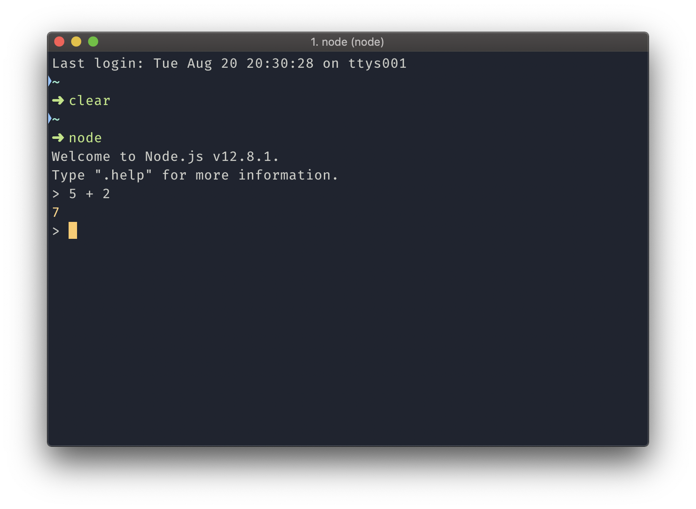
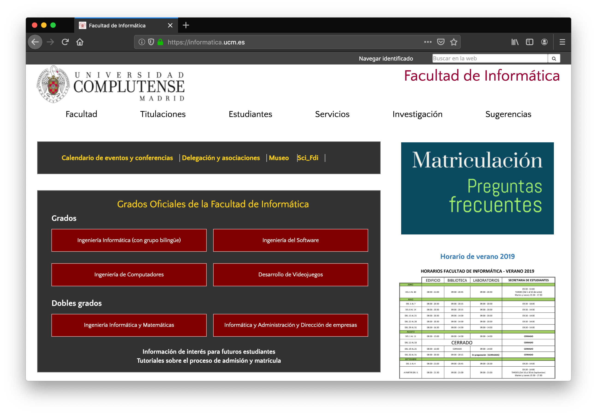

Escribir código no es todo lo que hacemos cuando programamos

---

También:

-  gestionamos archivos
-  gestionamos versiones
-  hacemos publicaciones
-  nos comunicamos con el resto del equipo
-  compilamos/cargamos en el intérprete
-  probamos
-  depuramos
- ...

## Toolset JS

Existen entornos de desarrollo integrados (IDEs) que permiten trabajar en JavaScript

Nosotros no vamos a trabajar con ellos

> El objetivo es aprender cómo funcionan cada una de las piezas

---

El **ecosistema** de herramientas de JS es muy amplio y hay muchas opciones

Podéis usar las que queráis, pero **tenéis que hacer las entregas según el toolset que se establezca**

## Editor de textos

En general, la mayor parte del tiempo se interactúa con el editor de textos

Esto lo convierte en una de las herramientas fundamentales

---

{width=70%}

## Consola

La consola (*emulador de terminal*) es la herramienta a través de la cual se interactúa con el sistema operativo mediante comandos textuales

---

La consola es menos evidente para el usuario, pero tiene un sinfín de posibilidades y ofrece mucha **potencia de uso**

---

{width=70%}


## Intérprete

El *intérprete* es el programa que recibe el código (en forma de archivo o de instrucciones separadas) y se encarga de ejecutarlo

## Navegador

---

Un navegador es un programa capaz de analizar archivos en HTML y mostrarlos como una [página web](https://es.wikipedia.org/wiki/P%C3%A1gina_web).

{ width=40% }\

Hoy en día, los navegadores más usados contienen un intérprete de JavaScript.

---

Además, los navegadores proveen al intérprete con un modelo del documento ([DOM-Document Object Model](https://es.wikipedia.org/wiki/Document_Object_Model)), que es un API para acceder a una página web


## Servidores web

Un *[servidor web](https://es.wikipedia.org/wiki/Servidor_web)* es un programa de ordenador que, a través de la red, "escucha" peticiones según el protocolo HTTP y envía, como respuesta, páginas web

## Librerías

---

Crear programas que ya han sido programados por otros es una **pérdida de tiempo**

---

Las librerías son fragmentos de código que quedan disponibles para el programador:

```javascript
// usamos librerías para imprimir contenido
console.log("hola");

// o para mejorar nuestro estilo de código
_.map([1, 2, 3], function(num){ return num * 3; });

// o para acceder a frameworks completos
var gamePh2 = new Phaser.Game(800, 600, 
                    Phaser.CANVAS, 
                    'phaser-example',
                    { create: create });
```

## Gestión de versiones

Aparte de los programas muy pequeños, nadie escribe un programa, lo termina y no vuelve a tocarlo nunca

---

> **Siempre** existen versiones de código

---

Las versiones de código, bien usadas, permiten:

-   flexibilidad
-   seguridad
-   trabajo en grupo
-   histórico y revisiones
-   análisis de evolución
-   aceptar contribuciones externas
-   libertad de experimentación

# Herramientas para este curso

## Herramientas para desarrollar juegos en la web

Vamos a seguir estas ideas, usando herramientas profesionales

## Editor de textos

---

Es importante (al menos muy útil) usar un editor profesional:

-   [VSCode](https://code.visualstudio.com)
-   [Atom](https://atom.io/)
-   [Sublime](https://www.sublimetext.com/)
-   [Vim](http://www.vim.org/)
-   [Emacs](https://www.gnu.org/software/emacs/)

---

Características deseables:

-   Coloreado de sintaxis
-   Indentación apropiada
-   Ayudas a la edición:
    -   Completado de paréntesis
    -   Autocompletado de código
-   Autocompletado semántico

## Consola/Shell

La consola por defecto de Windows es muy pobre

Hay alternativas:

-   [Cmder](http://cmder.net/)
-   [Conemu](https://conemu.github.io/)
-   [iTerm2](https://www.iterm2.com/)
-   Casi cualquiera en GNU/Linux ([GNOME Terminal](https://es.wikipedia.org/wiki/GNOME_Terminal), [Konsole](https://www.kde.org/applications/system/konsole/))

---

La *shell* es el programa que se ejecuta en la terminal (que es la ventana)

En **fundamental** diferenciar entre emulador de terminal (la "ventana") y el "shell", que es el programa que **se ejecuta dentro de la ventana** y que procesa nuestros comandos

## Alternativas típicas para la shell

-   [Cygwin](https://www.cygwin.com/), o para más comodidad [MSYS2](https://msys2.github.io/), permiten correr shell UNIX en Windows
-   [Bash](https://es.wikipedia.org/wiki/Bash)
-   [Zsh](http://www.zsh.org/)

## Intérprete

Las primeras semanas usaremos `node.js`, con la versión **que haya instalada en los laboratorios**

{width=40%}

---

`Node.js` incluye un *gestor de paquetes*, [`npm`](https://www.npmjs.com/)


---

Un gestor de paquetes es una herramienta, generalmente con interfaz de terminal, que permite instalar librerías, gestionar dependencias entre ellas y lanzar aplicaciones con comandos simples

---

Así, no hace falta buscar una librería en Internet, encontrar la carpeta donde descargarla, probar la versión, ver que falla y tener que buscar la dependencia...

---

Los paquetes tienen [dependencias](http://npm.anvaka.com/). Por ejemplo, [`browserify`](http://npm.anvaka.com/#/view/2d/brows   erify)

{width=50%}

---

`npm` gestiona las dependencias por nosotros

## Navegador

Usaremos Chrome/Chromium, con la versión **que haya instalada en los laboratorios**


## Servidores web

Aunque, en general, no hará falta instalarlo explícitamente, usaremos cualquier servidor `http`

Para probar, podéis instalar `http-server`, es un "one-liner":

---

```bash
$ npm install http-server # para instalarlo (no es necesario)
$ npx http-server  # para ejecutarlo
```

> `npm install` lo descarga, crea una carpeta para instalarlo y lo instala en local junto con sus dependencias

> `npx` lo ejecuta, pero además lo instala si no estaba instalado


---

También está `live-server`, que actualiza automáticamente el navegador cuando hay cambios:

```bash
$ npm install live-server # para instalarlo (no es necesario)
$ npx live-server # para ejecutarlo
```

---

Estos programas sirven sólo *a partir del directorio en el que se ejecutan, **nunca rutas por encima***

```bash
$ pwd
/home/usuario/misarchivos
$ cd docs
$ npx live-server # `localhost` equivale a `docs/`
```

En el caso anterior, no puedo ir a una URL `'../anterior.png'`{.js} que esté en `misarchivos`


---

Si la versión de `npm` es menor que 5.2.0, habrá que instalar `npx` de forma manual (hace falta ser administrador):

```bash
$ npm install -g npx
```

---

También odemos arrancar un servidor web por defecto en Python:

```bash
➜ python -m SimpleHTTPServer
Serving HTTP on 0.0.0.0 port 8000 ...
```

> Es decir, no es necesario `node` para un servidor web

## Librerías

Usaremos muchas, pero en general sólo veremos algunas (la mayoría serán dependencias)

Para los juegos usaremos [Phaser](http://phaser.io/){width=50%}

---

{height=20%}

## Gestión de entregas

Las entregas del proyecto estarán disponibles en un repositorio `git`

Para entregar, hay que seguir las tener todo en un repositorio, según las condiciones de entrega (expuestas en el CV)

## Git

[Git](https://git-scm.com/) es el sistema de control de versiones que usaremos para la asignatura

- [Guía sencilla](http://rogerdudler.github.io/git-guide/index.es.html)
- [Git in Couples](https://github.com/delapuente/gitincouples)

## Gestión de proyecto

Trello, GitHub Project, Pivotal...

---

Cualquier herramienta vale, pero usaremos alguna variante de Scrum, y habrá que marcar:

- *Costes* de cada tarea/historia de usuario
- *Responsable* de cada tarea
- *Estado* de cada tarea


## Demostración

Ahora, un ejemplo de una manera de desarrollar