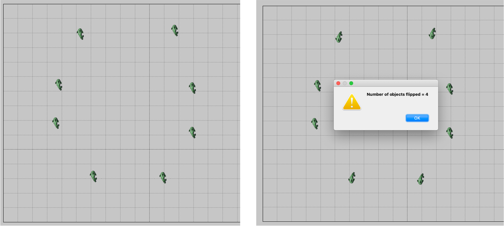

# Scripting con JavaScript en Tiled

---

A partir de la versión 1.3, Tiled permite crear scripts con JavaScript

<!-- ---

Para hacer scripting, ahora mismo hay que bajarse un *snapshot* de versión beta desde la [página de Tiled](https://thorbjorn.itch.io/tiled) -->

---


---


---


---

Se puede pegar un script pequeño de JavaScript en la línea de comandos, o se pueden ejecutar aquellos que está en [la carpeta `extensions`](https://doc.mapeditor.org/en/latest/reference/scripting/#script-extensions)

---

Preguntar algo al usuario:

```js
if(tiled.confirm("¿Quieres borrar todo el mapa?", "Borrado total")) {
	tiled.alert("¡Borrado!");
}
```

---

Recorrer todo el mapa y cambiar una propiedad:

```js
for(let x = 0; x < tiled.activeAsset.width; x++) {
	for(let y = 0; y < tiled.activeAsset.width; y++) {
		tiled.activeAsset.currentLayer.tileAt(x, y).propiedad = valor;
	}
}
```

---

La [API](https://doc.mapeditor.org/en/latest/reference/scripting/) del motor de JavaScript tiene detalles de cómo se puede hacer extensiones a Tiled con JavaScript

# Ejemplo: Flip aleatorio de objetos

---

Queremos que en una capa de objetos, algunos de los objetos cambien su orientación vertical (así, no tenemos que andar cambiando la propiedad manualmente)

---



---

Recorremos un mapa y hacemos flip aleatoriamente a los objetos

```js
function flipObjects(map) {
	for (let i = map.layerCount - 1; i >= 0; i--) {
		const layer = map.layerAt(i);
		let numFlips = 0;
		if (layer.isObjectLayer) {
			for (const obj of layer.objects) {
				let coin = Math.random()
				if (coin < 0.5) {
					obj.tileFlippedVertically = true;
					numFlips++;
				}
			}
		}
		return numFlips;
	}
}
```

---

Creamos una acción para ejecutar la función anterior

```js
let flipObject = tiled.registerAction("FlipObject", function(/* action */) {
	const map = tiled.activeAsset;
	if (!map.isTileMap) {
		tiled.alert("Not a tile map!");
		return;
	}

	const numFlips = flipObjects(map);
	tiled.alert("Number of objects flipped = " + numFlips);
		return;
});
flipObject.text = "Flip objects in layer";
flipObject.shortcut = "Ctrl+Shift+F";
```

---

Añadimos la acción al menú de Layer

```js
tiled.extendMenu("Layer", [
	{ separator: true },
	{ action: "FlipObject" },
]);
```


