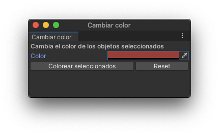

# Scripting con C# en Unity

---

C# en Unity se utiliza principalmente para:

- Creación de contenidos de gameplay
- Extender la funcionalidad del editor

---

La primera ya la hemos usado bastante.

Veamos, por tanto, como modificar el editor con C#.

---

## Generalidades

- Se guardan en una carpeta `Editor` dentro de la carpeta `Assets` de Unity
- No heredan de `MonoBahaviour` sino que usan otras clases de Unity como `Editor` o `EditorWindow`
- Estas clases (y otras) están en la librería `UnityEditor`

```csharp
using UnityEditor;
```

## IMGUI

[**I**mmediate **M**ode **GUI**](https://docs.unity3d.com/ScriptReference/UnityEngine.IMGUIModule.html)

- La creación y el comportamiento de la interfaz se implementan a la vez
- Para crear interfaces de juego y modificar el editor
- Usaremos las factorías de [`GUI`](https://docs.unity3d.com/ScriptReference/GUI.html) y de [`GUILayout`](https://docs.unity3d.com/ScriptReference/GUILayout.html) (y [`EditorGUILayout`](https://docs.unity3d.com/ScriptReference/EditorGUILayout.html), en algunos casos)


# Crear ventanas del editor

---

Sirve para crear nuevas ventanas para incorporarlas al editor de Unity. 

Estas nuevas ventanas nos permitirán hacer funciones adicionales que no están definidas en el editor de Unity.

---

## En breve...

- Extender la clase [`EditorWindow`](https://docs.unity3d.com/ScriptReference/EditorWindow.html)
- Implementar la interfaz y el comportamiento en [`OnGUI`](https://docs.unity3d.com/ScriptReference/EditorWindow.OnGUI.html) con IMGUI.

## Ejemplo: Herramienta para colorear objetos seleccionados



---

```csharp
using UnityEngine;
using UnityEditor;

public class ColorizerWindow : EditorWindow {
    
    Color selectedColor;

    // Creamos una opción de menú para mostrar la ventana
    [MenuItem("Window/Colorizer")]
    public static void ShowWindow() {
    	// Mostramos la ventana
        GetWindow<ColorizerWindow>("Cambiar color");
    }
...
```


---

```csharp
...
void OnGUI() {
	// Etiqueta de la ventana
    GUILayout.Label("Cambia el color de los objetos seleccionados", EditorStyles.boldLabel);

    // Selector de color
    selectedColor = EditorGUILayout.ColorField("Color", selectedColor);
...
```

---

```csharp
...
// Layout horizontal
GUILayout.BeginHorizontal();
// Primer botón
if (GUILayout.Button("Colorear seleccionados")) {
	// Selection nos da acceso a los objetos seleccionados
    foreach (GameObject obj in Selection.gameObjects) {
        Renderer selectedRenderer = obj.GetComponent<Renderer>();
        if (selectedRenderer != null) {
			// OJO: esto crea una nueva instancia del material
            // Si usamos sharedMaterial cambiamos el compartido por
            // todos los objetos
            selectedRenderer.material.color = selectedColor;
        }
    }
}
...
```

---

```csharp
...
// Creamos el botón de Reset
if (GUILayout.Button("Reset")) {
    foreach (GameObject obj in Selection.gameObjects) {
        Renderer selectedRenderer = obj.GetComponent<Renderer>();
        if (selectedRenderer != null) {
            // OJO: esto crea una nueva instancia del material
            // Si usamos sharedMaterial cambiamos el compartido por
            // todos los objetos
            selectedRenderer.material.color = Color.white;
        }
    }
}
// Dejamos de usar el layout horizontal
GUILayout.EndHorizontal();
} // OnGUI
}
```

# Crear inspectores de componentes personalizados

---

Sirve para crear paneles de edición de componentes (_inspectors_) personalizados con el fin de facilitar y acelerar el desarrollo de gameplay.

---

## En breve...

- Añadir el atributo `[CustomEditor(typeof(MI_MONOBEHAVIOUR))]`
- Extender la clase [`Editor`](https://docs.unity3d.com/ScriptReference/Editor.html)
- Implementar la interfaz y el comportamiento en [`OnInspectorGUI`](https://docs.unity3d.com/ScriptReference/Editor.OnInspectorGUI.html) con IMGUI (incluyendo elementos del [`EditorGUILayout`](https://docs.unity3d.com/ScriptReference/EditorGUILayout.html))
- [`target`](https://docs.unity3d.com/ScriptReference/Editor-target.html) da acceso al componente 
- [`serializedObject`](https://docs.unity3d.com/ScriptReference/Editor-serializedObject.html) da acceso al componente _serializado_ de modo que se pueda utilizar las operaciones de Undo y la actualización de los Prefabs

---

## Ejemplo: Panel para la creación de waypoints


---

```csharp
public class FollowWaypoints : MonoBehaviour {
    public List<GameObject> waypoints;
	
	void Awake() {
		waypoints = new List<GameObject>();
	}
}
```

---

```csharp
using UnityEngine;
using UnityEditor;

[CustomEditor(typeof(FollowWaypoints))]
public class FollowWaypointsEditor : Editor
{
    private FollowWaypoints theTarget;
    private void OnEnable()
    {
    	// Referencia al componente
        theTarget = target as FollowWaypoints;
    }
...
```

---

```csharp
...
public override void OnInspectorGUI() {
	// Comenzar con base.OnInspectorGUI() si queremos
	// mantener la info por defecto del inspector
    EditorGUILayout.HelpBox("Use buttons to create waypoints or remove them",
                                MessageType.Info);
    EditorGUILayout.Space();
    // Etiqueta 
    EditorGUILayout.LabelField("Number of waypoints: ",
        theTarget.waypoints.Count.ToString());

    // Layout horizontal
    GUILayout.BeginHorizontal();

    // Comportamiento del botón para crear waypoints
    if (GUILayout.Button("Create Waypoint")) {
        GameObject sphere = GameObject.CreatePrimitive(PrimitiveType.Sphere);
        theTarget.waypoints.Add(sphere);
    }
}
...
```

---

```csharp
...
// Comportamiento del botón de borrado de waypoints
if (GUILayout.Button("Clear Waypoints"))
{
    foreach (GameObject item in theTarget.waypoints)
    {
        GameObject.DestroyImmediate(item);
    }
    theTarget.waypoints.Clear();
}
// Fin del layout horizontal
GUILayout.EndHorizontal();
} // OnInspectorGUI
}
```

# Personalizar la inspección de componentes

---

Unity permite mostrar elementos en la escena que nos ayuden a la hora de definir un componente desde el inspector.

---

## En breve...

- Añadir el atributo `[CustomEditor(typeof(MI_MONOBEHAVIOUR))]`
- Extender la clase [`Editor`](https://docs.unity3d.com/ScriptReference/Editor.html)
- Implementar la interfaz y el comportamiento en [`OnSceneGUI`](https://docs.unity3d.com/ScriptReference/Editor.OnSceneGUI.html) con IMGUI (incluyendo elementos del [`EditorGUILayout`](https://docs.unity3d.com/ScriptReference/EditorGUILayout.html))
- Usar [`Handles`](https://docs.unity3d.com/ScriptReference/Handles.html) para dibujar elementos en la escena
- [`target`](https://docs.unity3d.com/ScriptReference/Editor-target.html) da acceso al componente 
- [`serializedObject`](https://docs.unity3d.com/ScriptReference/Editor-serializedObject.html) da acceso al componente _serializado_ de modo que se pueda utilizar las operaciones de Undo y la actualización de los Prefabs

---

## Ejemplo: Rutas por Waypoints


---

Igual que en el ejemplo anterior...

```csharp
using UnityEngine;
using UnityEditor;

[CustomEditor(typeof(FollowWaypoints))]
public class FollowWaypointsEditor : Editor {
	...
```

---

```csharp
...
// Dibuja una línea entre los puntos de la ruta
void OnSceneGUI() {
    // Dibujamos si tenemos al menos dos waypoints
    if ( theTarget == null  
    	 ||   theTarget.waypoints == null
    	 ||   theTarget.waypoints.Count <=1 )
        return;

    // Seleccionamos el primer punto de ruta
    Vector3 first = theTarget.waypoints[0].transform.position;
    Vector3 current = first;
...
```

---


```csharp
...
    // Iteramos entre el resto de puntos de ruta...
    for (int i = 1; i < theTarget.waypoints.Count; i++) {
        // ... y dibujamos una línea entre ellos
        if (theTarget.waypoints[i] != null)
        {
            Handles.DrawLine(
            	current, 
            	theTarget.waypoints[i].transform.position
            );
            current = theTarget.waypoints[i].transform.position;
        }
    }

    // Dibujamos la línea que cierra la ruta
    Handles.DrawLine(current, first);
} // OnSceneGUI
}
```
