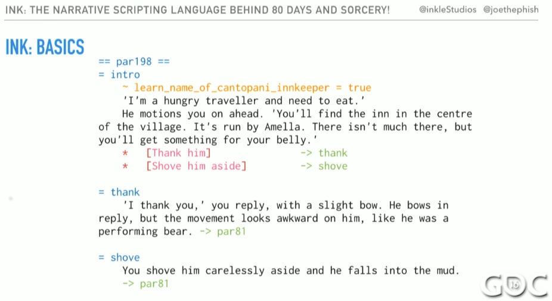
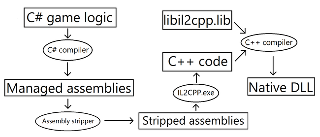
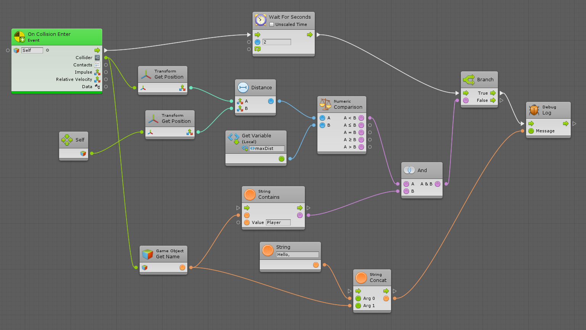
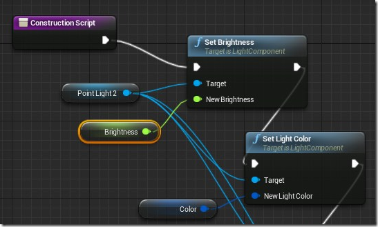

# Lenguajes de scripting

---

## ¿Qué es un lenguaje de scripting?

Los lenguajes de scripting, normalmente interpretados, son lenguajes que son concebidos para ser usados como parte de una herramienta

---

Algunos lenguajes de scripting se crearon como lenguajes de propósito general (como Python) pero la mayoría de ellos surgieron como extensiones de herramientas específicas (como Ink o Squirrel)

---

## Javascript como lenguaje de scripting

JavaScript fue concebido como una forma de programar sobre el navegador web

---

## Ejemplo: Firefox

{width=30%}

---

## Ejemplo: Firefox

- Gecko: Es el núcleo de Firefox y está escrito en C/C++
  	- Tiene un motor Web
  	- Y un engine de renderización
- El motor usa un interprete de JavaScript: Spider-Monkey
- El interprete de JavaScript se comunica con Gecko
- Lo que programas en JavaScript afecta al comportamiento del engine de Firefox

## ¿Cómo se consigue?

---

- Hay que crear una API en C/C++ a la que invocar desde JavaScript
- Hay que crear las llamadas en JavaScript que invocan el API en C/C++


# Otros lenguajes de scripting

---

Además de Javascript, existen 

---

## PHP

PHP es un lenguaje de scripting para permitir expandir la funcionalidad del servidor web Apache

Hoy en día se usa como lenguaje de propósito general para crear aplicaciones web de servidor

---

Su motor, **Zend Engine**, está escrito en C y puede ser usado desde cualquier servidor web como lenguaje de scripting de forma fácil

También se puede extender su funcionalidad escribiendo extensiones en C

---

## Bash

La consola de comandos Bash, consola principal de los sistemas Linux/Unix, tiene un lenguaje de scripting que permite programar sobre ella

---

## Python

Python es un lenguaje de propósito general creado para que fuese fácil de aprender y de usar por usuarios con un nivel de alfabetización básico en lenguajes de programación

Necesita un interprete que debemos instalar en el sistema para poder usarlo (similar a node con JavaScript) y se ha usado mucho como sustituto de los lenguajes de scripting clásicos para sistemas operativos como Bash o la consola de MS-DOS/Windows

---

Actualmente el uso de Python se ha extendido enormemente, no sólo como lenguaje de propósito general, si no como lenguaje de *scripting de propósito general*

Python es relativamente fácil de usar desde una aplicación escrita en otro lenguaje (típicamente C/C++) por lo que se ha usado como lenguaje de scripting en muchas aplicaciones

[Python en una aplicación](https://docs.python.org/3/extending/embedding.html)

---

## Lua

[Lua](https://www.lua.org/) es uno de los lenguajes de scripting más usado en motores de juegos

Es relativamente rápido, y es muy fácil conectarlo con en motor en C/C++

---

Lua fue expresamente diseñado para ser usado como lenguaje de scripting en otros lenguajes

Hay una gran [lista de juegos que han utilizado Lua como lenguaje de scripting](https://en.wikipedia.org/wiki/Category:Lua_%28programming_language%29-scripted_video_games)

---

Pero también se usa en aplicaciones

Por ejemplo, el reproductor multimedia VLC utiliza LUA para que los usuarios puedan crear sus propias extensiones

[Scripts para VLC en Lua](https://forum.videolan.org/viewforum.php?f=29)

# Uso de los lenguajes de scripting en videojuegos

---

## Usos principales

- Creación de herramientas para el desarrollo de recursos
- Creación de contenidos de gameplay
- Creación de extensiones para herramientas existentes (y que lo permitan) 
- Automatización (lo veréis en los últimos cursos)

# Creación de herramientas para el desarrollo de recursos

---

En la industria de videojuegos existen muchos roles: diseñadores, animadores, concept artists, músicos...

No todos programan (ni se espera que lo hagan)

---

Los programadores no solo desarrollan gameplay sino que se encargan de la implementación de herramientas que ayuden a que otros miembros del equipo puedan hacer su trabajo

Muchas de estas herramientas se desarrollan usando lenguajes de scripting

---

## Editor de sprites

](piskel.png){width=50%}

<small>Desarrollado en JavaScript. Código disponible [en este repositorio](https://github.com/piskelapp/piskel)</small>

---

## Efectos sonoros y música

](jsfxr.png){width=35%}

<small>Desarrollado en JavaScript. Código disponible [en este repositorio](https://github.com/chr15m/jsfxr)</small>

---

## Efectos sonoros y música

](chiptone.png){width=65%}


---

## Efectos y partículas

Configurar un emisor de partículas

```js
particles.createEmitter({
    alpha: { start: 1, end: 0 },
    scale: { start: 0.5, end: 2.5 },
    //tint: { start: 0xff945e, end: 0xff945e },
    speed: 20,
    accelerationY: -300,
    angle: { min: -85, max: -95 },
    rotate: { min: -180, max: 180 },
    lifespan: { min: 1000, max: 1100 },
    blendMode: 'ADD',
    frequency: 110,
    maxParticles: 10,
    x: 400,
    y: 300
});
```

<small>Se puede ver en funcionamiento [en esta página](https://phaser.io/examples/v3/view/game-objects/particle-emitter/fire-max-10-particles#)</small>


---

## Editor de efectos y partículas

](https://raw.githubusercontent.com/koreezgames/phaser3-particle-editor/master/showcase.gif)

<small>Desarrollado en TypeScript. Código disponible [en este repositorio](https://github.com/koreezgames/phaser3-particle-editor)</small>


---

## Editor de efectos y partículas

](revoltfx.png){width=50%}

<small>Desarrollado en JavaScript. Código disponible [en este repositorio](https://github.com/bma73/revolt-fx)</small>

---

## Editores de mapas específicos

, con desarrollo para HTML5 y JS](rpg.jpg)


# Creación de contenidos de gameplay

---

Los programadores no somos creativos (en general)

La mayoría de los contenidos de gameplay no son desarrollados por los programadores

Los programadores crean "piezas" que los diseñadores de niveles y otros usan para componer el videojuego

---

Para crear los contenidos se usan:

- Lenguajes de scripting conocidos
- Creamos lenguajes propios más expresivos (incluso visuales)

---

## Ink

- Lenguaje y herramientas para la creación de videojuegos narrativos
- Usado en [80 days](https://www.youtube.com/channel/UCvnHxTnr-J3xYg0RaVJVMUQ) o [Sorcery!](https://www.youtube.com/channel/UCUhIQUAgCHdZtfD-pz1nGPQ)
- [Ink es de acceso libre](https://www.inklestudios.com/ink/) y tiene un editor llamado [Inky, desarrollado en Javascript](https://github.com/inkle/inky)

---



<small>Más detalles sobre el lenguaje [en esta charla de la GDC](https://www.youtube.com/watch?v=KYBf6Ko1I2k)</small>

---

## Squirrel

- Lenguaje imperativo similar a Lua
- Desarrollado por [Alberto Demichelis](http://squirrel-lang.org/)
- Usado en [Left 4 Dead 2](https://www.youtube.com/channel/UCE8i1bve9eHEc_yn63NIX7A) y [Portal 2](https://www.youtube.com/channel/UCn0PHntRGo_-S700MrnY-bg)

---

En [L4D2](https://developer.valvesoftware.com/wiki/L4D2_Vscripts) se usa para:

- Añadir "inteligencia" e interacción a entidades del mundo
- Para crear mods de mapas y spawnear entidades
- Para modificar el comportamiento del [AI director, responsable de controlar la generación de hordas de infectados](https://steamcdn-a.akamaihd.net/apps/valve/2009/ai_systems_of_l4d_mike_booth.pdf)

---

## Lua en CryEngine

El motor CryEngine de Crytek utiliza Lua como lenguaje de scripting

Los programadores del engine pueden exponer funciones de sus clases creadas en C++ para que los programadores de scripting en Lua puedan usarlas

[Lua en CryEngine](http://docs.cryengine.com/display/SDKDOC4/Lua+Scripting)

## Luabind

[Luabind](http://www.rasterbar.com/products/luabind.html) es una librería que ayuda a usar Lua desde C++. Simplifica la tarea y permite hacer entre otras cosas:

- Tener clases de C++ en Lua
- Tener funciones y clases de Lua en C++
- Polimorfismo de los métodos de una clase base en C++ desde una clase derivada en Lua

---

## C# en Unity

- El núcleo de Unity está implementado en C/C++
- Los GameObjects y algunos componentes están implementados en ese mismo lenguaje
- Si queremos crear nuevos componentes (y, por tanto, nuevo contenido) entonces usamos C# como lenguaje de scripting

---

- Unity tiene un _wrapper_ que permite la interconexión entre los scripts en C# y el núcleo en C++
- Los scripts son compilados usando los _scripting backends_ Mono, .NET o IL2CPP e integrados en el ejecutable

---



<small>Podéis conocer más sobre el scripting de Unity [a través de su manual](https://docs.unity3d.com/Manual/ScriptingSection.html)</small>
 
---

## Scripting Visual

Algunos motores usan lenguajes de scripting visual para la creación de contenidos

Los lenguajes visuales se suelen componer de bloques con parámetros y flechas que indican el flujo de ejecución

La programación por bloques es más sencilla para no programadores

---

## Bolt en Unity



---

## Blueprints en Unreal   



---

# Creación de extensiones para herramientas existentes

---

Por último, vamos a ver que algunas de las herramientas usadas en el desarrollo de videojuegos pueden ser ampliadas y mejoradas para la realización de tareas específicas de nuestro equipo de desarrollo

---

Como hemos visto anteriormente con la creación de contenidos, estas herramientas han de estar diseñadas para proporcionar una API que permita extender la herramienta con un lenguaje de scripting

---

## Extender Blender con Python

[Blender](https://www.blender.org/) es una herramienta de código libre para crear y renderizar objetos 3D

Aunque Blender está escrito en C/C++ usa Python como lenguaje de scripting para facilitar la creación de macros y add-ons por parte de los usuarios

---

Blender dispone de una [API de scripting en Python](https://docs.blender.org/manual/en/latest/advanced/scripting/introduction.html) 

Podéis ver un ejemplo para la [creación de una herramienta de texto en este vídeo](https://www.youtube.com/watch?v=4KwPhQX63SQ)

---

## Extender Audacity con Nyquist

[Audacity](https://audacity.es/) es una herramienta de edición de audio [de código abierto](https://github.com/audacity/audacity) implementada en C++

Soporta distintos tipos de extensiones, muchas de ellas implementadas en C/C++, como LV2 o VST

---

Pero también permite [crear extensiones usando Nyquist](https://wiki.audacityteam.org/wiki/Nyquist_Documentation), un lenguaje similar a LISP para la síntesis de audio 

Esto nos permite crear nuestros propios efectos para aplicarlos automáticamente al audio de nuestro videojuego

---

Añadir ecos a una pista de audio

```
;nyquist plug-in
;version 4
;type process
;name "Delay..."
;control decay "Decay amount" int "dB" 6 0 24
;control delay "Delay time" float "seconds" 0.5 0.0 5.0
;control count "Number of echos" int "times" 5 1 30

(defun delays (sig decay delay count)
(if (= count 0)
    (cue sig)
    (sim (cue sig)
         (loud decay (at delay (delays sig decay delay (- count 1)))))))

(stretch-abs 1 (delays *track* (- 0 decay) delay count))
```


---

## Extender el editor de Unity con C#

Lo veremos en un tema aparte

---

## Extender Tiled con JS

Lo veremos en un tema aparte


