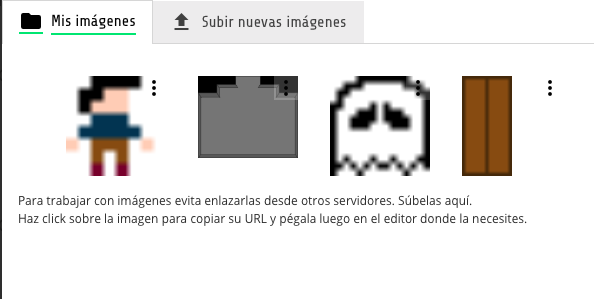
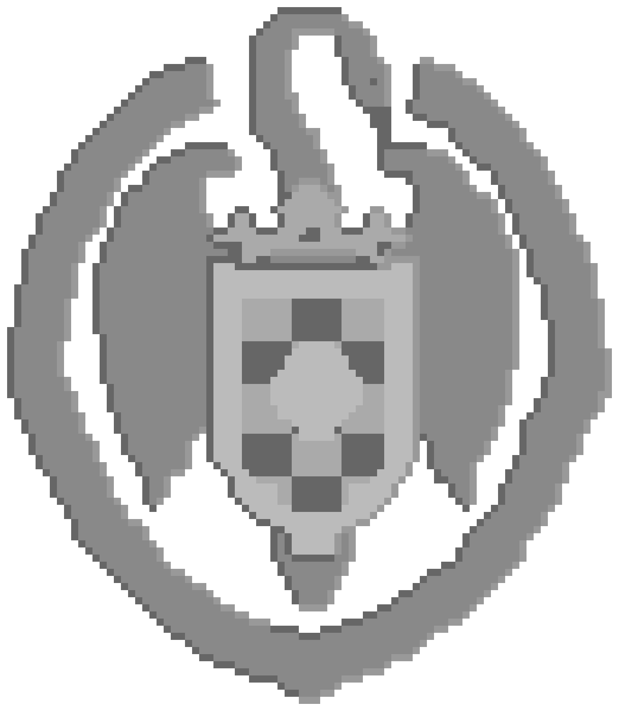
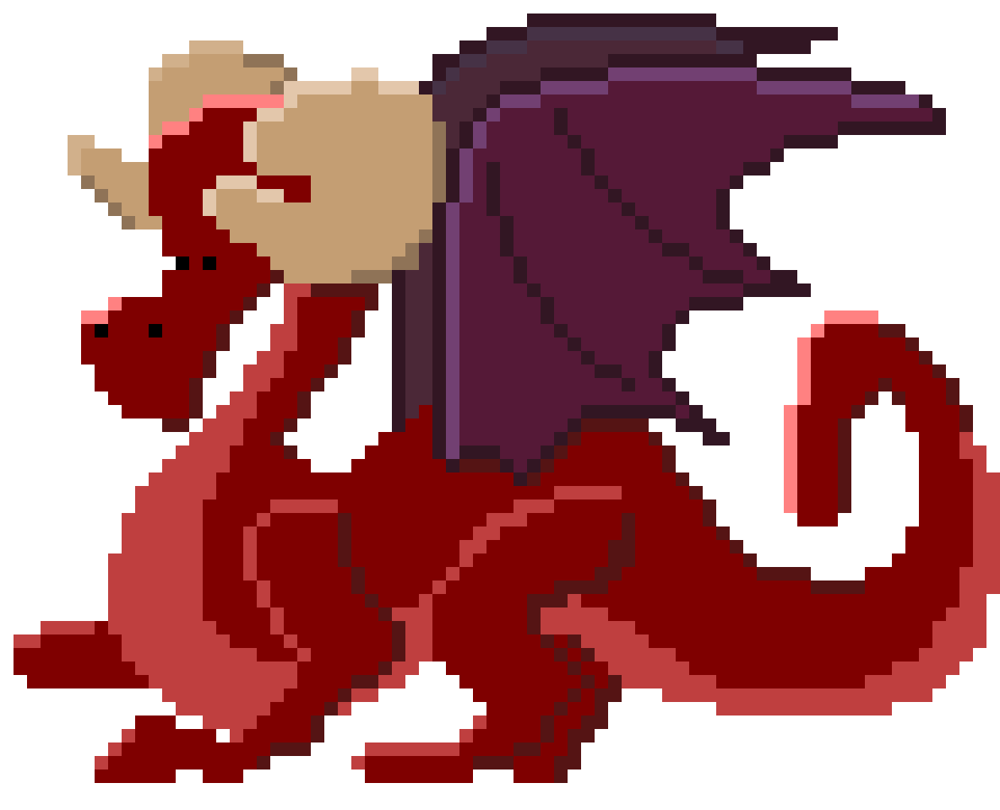
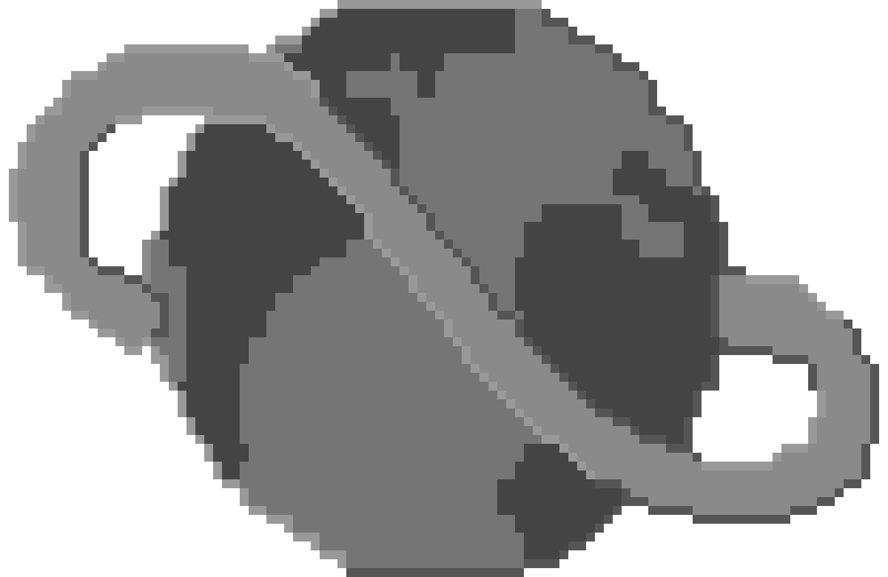
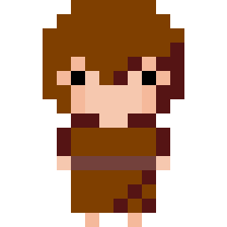
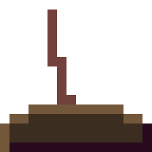
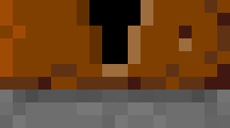
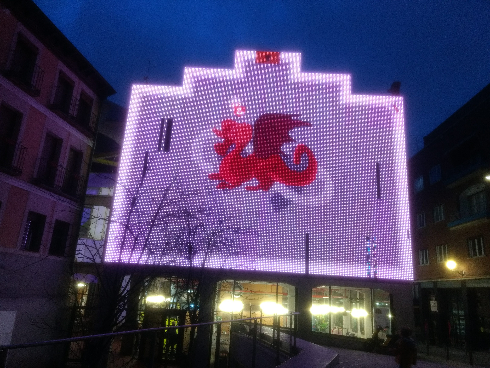

# Contexto

---

## GameJam 2020

Del 31 de enero al 2 de febrero de 2020, UCM es sede GameJam 2020 en Madrid

---

## Medialab Prado

La GGJ UCM se organizó en Medialab Prado

<https://www.medialab-prado.es>

---

## Pantalla

Medialab Prado tiene una pantalla en la fachada exterior que se puede usar

<https://www.medialab-prado.es/noticias/fachada-digital-informacion-tecnica-0>

---

## Dimensiones

- 15m $\times$ 10m
- 192 $\times$ 157 "píxeles" (enormes)

---

{width=50%}

---

La pantalla sólo se ve bien de noche (está habilitada como de 18:30 a 23:30)

---

El tamaño de la plaza hace que se vea muy cerca, con lo que los píxeles inferiores se ven *bastante mayores* que los superiores

---

## Sonido

No hay sonido (está en medio de la calle)

---

## Cámaras

Hay un sistema CCTV que recoge la interacción de la gente en la plaza

*Y un API de alto nivel de reconocimiento de personas*


# Programando la fachada

---

Tienen un PC con salida directa a la fachada, con lo que cualquier trozo imagen que quepa en 192 $\times$ 157, se puede emitir

---

Esto requiere bastante gestión (aunque es posible)

---

## Processing

Medialab Prado ofrece un API de alto nivel para programar la fachada y la cámara

Está basado en [Processing](https://processing.org)

---

```java
int y = 100;

void setup() {
  size(640, 360); 
  stroke(255); 
  frameRate(30);
}
void draw() { 
  background(0); 
  y = y - 1; 
  if (y < 0) { 
    y = height; 
  } 
  line(0, y, width, y);  
} 
```

<small>[Enlace al ejemplo](https://processing.org/examples/setupdraw.html)</small>


# P5.js y JavaScript

---

Dado que *Programa la plaza* ofrece una plataforma web, se recomienda usar [P5.js](https://p5js.org), que es *Processing*, pero con JavaScript

---

```js
let y = 100;

function setup() {
  createCanvas(720, 400);
  stroke(255); 
  frameRate(30);
}
function draw() {
  background(0);
  y = y - 1;
  if (y < 0) {
    y = height;
  }
  line(0, y, width, y);
}
```

<small>[Enlace al ejemplo](https://p5js.org/examples/structure-setup-and-draw.html)</small>


---

Hacer con JavaScript y P5.js es mucho más flexible (y está más mantenido)


# Plataforma "Programa la plaza"

---

Desde <http://programalaplaza.medialab-prado.es> se puede crear una cuenta y empezar a programam directamente en el navegador

---

La plataforma no sólo ofrece un editor, también ofrece un API

---

## API seguimiento de personas (*tracking*)

```js
function setup() {
  api.tracking.connect();
}

function draw() {
  var blobs = api.tracking.getBlobs();
    for (var i = 0; i < blobs.length; i++) {
  }
}
```

---

## API de guardado

Datos que se almacenan durante el tiempo de muestra

```js
api.storage.set('valor', 15);
// ...
valor = api.storage.get('valor');
```

---

## Imágenes

Para usar imágenes (cualquier tipo soportado por P5.js), se suben a la plataforma y luego se referencian por la URL que nos da el sistema

---

{width=50%}


# Proxy

---

"Programa la Plaza" tiene un *API* para el reconocimiento de personas:

```js
api.tracking.connect()
api.tracking.getBlobs()
```

*Pero no podemos usarlo mientras desarrollamos*

---

Para el desarrollo se creó un *proxy* del API que usa el ratón como sustituto de la cámara


---

Se crea un *array* (`api.tracking.blobs`{.js}) y, cada vez que se arrastra por pantalla (que simula a la cámara), metemos más elementos en el array

Este *array* simula los "blobs" que nos ofrece el *API*

---

Usamos `mouseDragged()`{.js} P5.js para recibir la entrada de ratón y cambiar al *array*:

```js
function mouseDragged() {
  if (overBox > released) {
    const found = api.tracking.blobs.find(blob =>
      blob.id === overBox)
    if (found) {
      found.x = mouseX
      found.y = mouseY
    }
  }
}
```

---

Después, exportamos nuestro propio objeto `api`{.js}

```js
const api = {
  // ...
  tracking: {
    connect: function () { },
    getBlobs: function () {
      return JSON.parse(JSON.stringify(api.tracking.blobs))
    },
    blobs: []
  }
}
```

---

Como hemos llamado igual a nuestro *API*, sólo tenemos que subir el código (sin nuestro *API* proxy), y funcionará


# El juego

---


---

En el juego, los jugadores sólo se mueven por la plaza (es la única entrada)

La cámara los reconoce, y nos ofrece posiciones de cada jugador $(x, y)$, a esto le llama *blob*

---

Cuando un *blob* cambia, primero vemos si es alguno que ya estaba o es nuevo (porque la *API* sólo nos dice el `id` del *blob*)

Se probó con `id` y con `posicion`, y por `id` funcionaba mejor

---

Con la posición, generamos enemigos (fantasmas), puertas y palancas

Las puertas se abren según el tipo de habitación:

- Solas (están abiertas)
- Cuando se derrota a todos los enemigos
- Cuando se activa una palanca

---

Hay 2 tipos de personajes:

- Guerreros (atacan "cuerpo a cuerpo")
- Magos (disparan bolas de fuego)

Como no hay más entrada que la posición, disparan solos cada cierto tiempo

---

Los personajes no mueren, no hay desafío real

Pero no es necesario, ya que la gente juega porque está en la calle, y por el avance en el juego

---

## Generación de habitaciones

La generación de habitaciones es aleatoria

Para no tener que llevar el control del mapa, evitamos que se vuelva a atrás, *no hay puertas ni hacia abajo ni por donde hemos venido*

---

## El dragón

A partir de cierto número de habitaciones, hay probabilidad de que aparezca el dragón

Cuando el dragón muere (necesita varios golpes)

---

## Desafíos de programación

El juego se hizo en P5.js, que es mucho menos potente que Phaser

---

### Animaciones

```js
actualizar() {
  super.actualizar()

  this.tiempoAnimacion += delta()
  if (this.tiempoAnimacion >= this.animacion.periodo) {
    this.tiempoAnimacion = 0
    const l = this.animacion.fotogramas.length

    if (this.fotograma === l - 1) {
      if (this.animacion.terminada && !this.terminadaLlamada) {
        this.animacion.terminada(this)
        this.terminadaLlamada = true
      }
      if (this.animacion.vuelta) {
        this.establecerFotograma()
      }
    } else {
      this.establecerFotograma(this.fotograma + 1)
    }
  }
}
```

---

### Colisiones

```js
// `input` puede ser un objeto, o la `x`
solapa(input, y = undefined, w = undefined, h = undefined) {
  const other = typeof input === 'number' ? { x: input, y, w, h } : input
  return this.x < other.x + other.w &&
    this.x + this.w > other.x &&
    this.y < other.y + other.h &&
    this.h + this.y > other.y
}
```

---

### Movimiento a un punto

```js
actualizar() {
  super.actualizar()
  if (this.vivo) {
    if (dist(this.x, this.y, this.destino.x, this.destino.y) < Fantasma.tamano) {
      this.nuevoDestino()
    }
    const v = Fantasma.velocidad / delta()
    const angulo = atan2(this.destino.y - this.y, this.destino.x - this.x)
    this.x += v * cos(angulo)
    this.y += v * sin(angulo)
  }
}
```


# Arte

---

Todo el juego se dibujó con arte píxel porque la pantalla tiene muy pocos puntos, y muy grandes

Se animó frame a frame

---

El arte es original, pero basado en buena medida en otros recursos encontrados en Internet

Algunas imágenes se calcaron con cierta libertad y luego se pasaron a arte píxel

---

¡Gracias al prof. Guillermo Jiménez por los logos de la UCM y la Game Jam!

---

{width=50%}


---

{width=50%}

---

{width=50%}

---

{width=50%}

---

{width=50%}

---

{width=50%}

---

{width=50%}

---

{width=50%}


---

{width=50%}


# El juego

---

Todo está [accesible en GitHub](https://github.com/cleongh/majemag)

---

{width=60%}