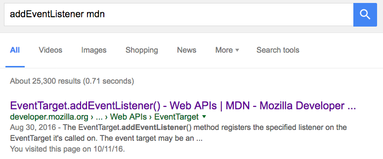

# JavaScript puede interactuar con la página web


## Document Object Model

- Los documentos HTML presentan una estructura de árbol
- Los navegadores nos dan una **interfaz para interactuar** con esta estructura: el **DOM**
- El punto de entrada para acceder al DOM es el objeto **global `document`{.js}**


## Ejemplo de una sección del DOM


```html
<article>
  <header>
    <h1>Un título molón</h1>
  </header>
  <p>Bla bla bla.</p>
  <p>
    Más bla, bla, bla y
    <a href="http://wikipedia.org">aquí un enlace</a>
  </p>
</article>
```

---


## ¿Qué podemos hacer con el DOM?

- Leer/escribir las propiedades de los elementos, y usar sus métodos
- Eliminar elementos del DOM
- Insertar nuevos elementos en el DOM


# Acceder a elementos del DOM


## Acceder a elementos por ID

Sólo selecciona un elemento (las ID's deben ser únicas)

```html
<button id="show-fullscreen">Fullscreen</button>
```

```javascript
const button = document.getElementById('show-fullscreen');
```


## Acceder a elementos por selector

Esto usa la sintaxis de los selectores CSS para localizar uno (o varios) elementos

```javascript
// selecciona el primer párrafo que encuentra
const paragraph = document.querySelector('p');
// selecciona el primer elemento con clase .warning
const label = document.querySelector('.warning');
// selecciona TODOS los párrafos
const allPars = document.querySelectorAll('p');
```

<small>Más info sobre selectores para usar con `querySelector` en [la MDN](https://developer.mozilla.org/en-US/docs/Web/Guide/CSS/Getting_Started/Selectors)</small>


## Iterar sobre una lista de elementos

- `querySelectorAll`{.js} _no_ devuelve un array, sino una [NodeList](https://developer.mozilla.org/en/docs/Web/API/NodeList)
- No podemos utilizar métodos de `Array`{.js} sobre ella. Pero tiene la propiedad `length`{.js} y el operador `[]`{.js}, así que podemos acceder en un bucle:

```javascript
const buttons = document.querySelectorAll('button');
for (const i = 0; i < buttons.length; i++) {
    buttons[i].style = "display: none"; // hide buttons
}
```

---

También podemos iterar con `Array.forEach`{.js} o con `for`{.js}/`of`{.js}:


```js
for (const b of buttons) {
    b.style = "display: none";
}

buttons.forEach(b => {
    b.style = "display: none";
})
```


## Navegar en el DOM

- Se accede al **padre** de un elemento con la propiedad `parentNode`{.js}
- Se accede a la lista de **hijos** de un elemento con `childNodes`{.js}
- Se accede al **hermano** anterior o siguiente con `previousSibling`{.js} y `nextSibling`{.js}

Con esto podemos recorrer todo el DOM en cualquier dirección


# Propiedades interesantes de elementos del DOM


## `innerHTML`{.js}

- El _interior_ (o contenido) del elemento
- Podemos escribir HTML dentro, creando al vuelo nuevos elementos del DOM

```javascript
button.innerHTML = 'Aceptar';
p.innerHTML = 'Párrafo con <b>negrita</b>';
```


## `style`

- Nos permite aplicar **estilos CSS inline** (tienen la máxima prioridad)
- Muy útiles para ocultar/mostrar elementos
- También podemos _leer_ la propiedad CSS

```javascript
const previousDisplay = button.style.display;
button.style="display:none"; // oculta cualquier elemento
button.style="display:inline-block;" // muestra el botón
```

<small>Nota: `display:none` es universal, pero para mostrar un elemento debéis elegir entre varios valores, los más comunes son `inline`, `inline-block` y `block`, pero hay muchos otros.</small>


## `classList`

- Nos permite acceder a las **clases CSS** de un elemento
- Útil para cambiar el aspecto de la UI en función de las interacciones

```javascript
button.classList.add('loading');
button.classList.remove('loading');
button.classList.contains('loading'); // query
button.classList.toggle('loading'); // doesn't work on IE
```

<small>[Snippet de código](https://developer.mozilla.org/en/docs/Web/API/Element/classList) online</small>


# Manipular el DOM


## Insertar elementos

- Podemos insertar elementos nuevos con `innerHTML`{.js}
- También se pueden crear desde cero

```javascript
const button = document.createElement('button');
button.innerHTML = 'Start';
button.setAttribute('type', 'button');

// <button type="button">Start</button>
```

---

- Cuando creamos un elemento con `createElement`{.js} está **huérfano** y no lo veremos renderizado en la página
- Hay que añadirlo como "familiar" de algún otro elemento con `appendChild`{.js}, `insertBefore`{.js}...

```javascript
document.body.appendChild(button);
```

<small>[Snippet de código](https://jsfiddle.net/mpsjmz11/1/) online</small>


## Eliminar elementos

- Podemos reemplazar un elemento por otro con `replaceChild`{.js}
- Podemos **eliminar** un elemento con `removeChild`{.js}

```javascript
const button = document.getElementById('start');
button.parentNode.removeChild(button);
```


# Eventos


## Eventos en el DOM

- Los elementos del DOM disparan eventos a los que podemos subscribirnos (click en un botón, cambio del texto de un `<input>`{.html}, cuando seleccionamos una checkbox, etcétera)
- `window`{.js} también dispara eventos: `load`{.js}, `resize`{.js}...


## Escuchar eventos

- Hay dos maneras de escuchar eventos disparados por un elemento:
    - Usando el método `Event.addEventListener`{.js}
    - Usando los _on-event handlers_ (p.ej `onclick`{.js}, `onfocus`{.js}...)


## On-event handlers

- ¡**Sólo hay un handler** por evento!
- Registramos y desregistramos el handler con una **asignación**

```javascript
// subscripción
button.onclick = function (evt) { /* ... */ };
// cancelar la subscripción
button.onclick = null;
```

<small>Documentación [en la MDN](https://developer.mozilla.org/en-US/docs/Web/Guide/Events/Event_handlers)</small>


## Event listeners

- Podemos subscribirnos **múltiples veces** al mismo evento
- Es la manera recomendada y más segura

```javascript
const sayHi = function () { /* */ };
// subscripción
button.addEventListener('click', sayHi);
// cancelar la subscripción
button.removeEventListener('click', sayHi);
```

<small>Documentación [en la MDN](https://developer.mozilla.org/en-US/docs/Web/API/EventTarget/addEventListener)</small>


## Bubbling

- El **bubbling** es la metáfora con la que explicamos cómo se comportan los eventos del DOM
- Cuando un elemento dispara un evento, **se propaga** hacia arriba en el árbol del DOM

---

```html
<section>
    <button>Click me</button>
</section>
```

```javascript
const section = document.querySelector('section')
section.addEventListener('click', function () {
    console.log('Clicked…');
});
```

<small>[Snippet de código](https://jsfiddle.net/mcx0hkou/1/) online</small>


## Interrumpir el bubbling

- Los callbacks de los eventos pueden recibir **un argumento** con información sobre el evento
- El argumento es un objeto de tipo `Event`{.js} y tiene métodos para interrumpir el bubbling

```javascript
button.addEventListener('click', function (evt) {
    console.log(evt);
});
```

---

Podemos evitar el bubbling con **`Event.stopPropagation`**

```javascript
button.addEventListener('click', function (e) {
    e.stopPropagation();
});
```


## Cancelar el evento

- ¡Esto **_no_ es interrumpir el bubbling**!
- Es cancelar el evento y evitar *acciones por defecto* asociadas a él. Es útil para interceptar formularios, o cambiar el comportamiento de un menú
- Usamos **`Event.preventDefault`{.js}**

---

```html
<a href="file.zip" download>Download zip</a>
```

```javascript
const link = document.querySelector('a');
link.addEventListener('click', function (evt) {
    // the browser won't detect the link has been clicked
    evt.preventDefault();
});
```


## Toda la documentación de esto está en la MDN

[http://developer.mozilla.org](http://developer.mozilla.org)

Truco: añadir `mdn` a cualquier búsqueda


