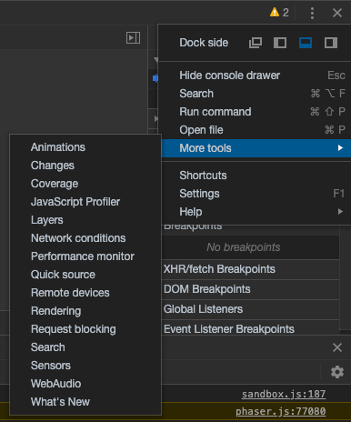
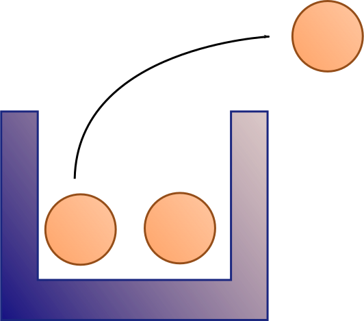

# Rendimiento


---

## El efecto de los objetos sobre el rendimiento

En general, cuantas más entidades gestione un juego, más deterioro del rendimiento

No es difícil degradar el rendimiento de un juego simplemente arrojando nuevas entidades a la escena. No es necesario ni modificarlas

<https://phaser.io/sandbox/dlqdIWMn>

---

El único factor que afecta al rendimiento es el **tiempo de procesamiento entre frames**

El problema es que el tiempo de procesamiento puede incrementarse de un sinfín de formas

---


La creación de entidades, su destrucción y el pintado de las mismas afecta al rendimiento porque crear, destruir y recorrer la lista de entidades a pintar **toma tiempo**

---


Si el tiempo entre frame y frame excede los 16.6 ms, el [_frame rate_](https://en.wikipedia.org/wiki/Frame_rate) disminuirá por debajo de 60 fps

---


En la pestaña "Rendering", podemos activar la opción "Frame Rendering Stats" en Chrome

{width=30%}

---


Además, en la pestaña "Performance", podemos guardar una ejecución del programa y veremos qué funciones se ejecutan y cuánto tiempo tardan en hacerlo

Hacer *profiling* es fundamental para ver cuál es el impacto **real** (y no sólo en teoría) de las partes de nuestro código


---

## El recolector de basura

En JavaScript apenas nos preocupamos por la vida de un objeto

Creamos el objeto con `new`{.js} y cuando no lo necesitamos más, sencillamente dejamos de usarlo

---


¿Qué pasa con los objetos que ya no se usan? La respuesta es que son recogidos
por el [recolector de basura](https://en.wikipedia.org/wiki/Garbage_collection_(computer_science)) y
destruidos de forma que la memoria que ocupan queda disponible de nuevo

---


Para ver cómo funciona, activamos las opciones de desarrollo (en este caso, en Chrome), y en la pestaña "Performance" grabamos mientras ejecutamos un juego, activando la opción de "Memory"


---


---


El recolector de basura es conveniente porque nos evita tener que liberar la memoria manualmente, previniendo que un objeto sea destruido accidentalmente cuando aún tenemos que usarlo


Sin embargo, introduce un problema de impredecibilidad, dado que no sabemos **ni cuándo sucederá ni cuánto tardará**

---

Una recolección de basura especialmente larga puede tirar el rendimiento y nada garantiza que la siguiente recolección no haga lo mismo y suceda en menor tiempo del deseado


# Pooling

---

## Controlar el impacto de crear y destruir objetos


Una forma de controlar el efecto de la creación de objetos y evitar la recolección de basura es mediante el uso del **[patrón _Object Pool_](https://en.wikipedia.org/wiki/Object_pool_pattern)** o depósito de objetos

---


La idea es sencilla: primero crearemos un _pool_ (depósito) de objetos estimando los que vayamos a utilizar durante el programa

{width=40%}

---


Cuando necesitemos un objeto, **en lugar de crearlo, se lo pediremos al _pool_** y luego lo usaremos normalmente

{width=40%}


---


Una vez terminemos de usar el objeto, **cuando ya no lo necesitemos, lo devolveremos al _pool_**

{width=40%}

---


Cuando necesitemos otro, volveremos a pedirlo al _pool_ de objetos

A lo largo de la ejecución del programa, los depósitos de objetos pueden permanecer fijos o redimensionarse de acuerdo a las necesidades del mismo


# El ciclo de vida de las entidades

---

## Reemplazar la creación constante con un *pool*


Si creamos una entidad con `new`{.js}, como hacíamos con los _sprites_, el objeto morirá cuando lo hace cualquier otro objeto de JavaScript, es decir, cuando nada hace referencia a él

En general, al salir del _scope_

---


Pero si añadimos la entidad al juego, bien explícitamente o a través de los métodos factoría de `add`, esta se mantendrá viva mientras dure el juego

---


La manera en que podemos destruir una entidad, es decir, eliminar todas sus referencias de forma que el recolector de basura pueda llevársela es mediante el método [`destroy()`{.js}](https://photonstorm.github.io/phaser3-docs/Phaser.GameObjects.GameObject.html#destroy) de la entidad

---


Por ejemplo, [el siguiente ejemplo](https://codepen.io/gjimenezucm/pen/MWmJder) muestra un máximo de 10 sprites en pantalla destruyendo la entidad más vieja cuando excedemos el máximo


```js
function preload ()
{
    this.load.setBaseURL('https://labs.phaser.io/assets/');
    this.load.image('phaser', 'sprites/phaser-dude.png');
}

update(time, delta) {    
    let x = Math.random() * 300;
    let y = Math.random() * 300;
    this.add.sprite(x, y, 'phaser');

    if (this.children.length > 10) {
        this.children.getChildren()[0].destroy();
        console.log('World children count:',
           this.children.length);
    }
}
```

---


Como veremos en breve, a veces nos interesará no destruir la entidad pero sí **dejarla inerte**, de forma que no se actualice, ni se pinte, ni interactúe con nada hasta que vuelva a interesarnos


Para ello podemos usar [_Grupos_ (Group)](https://newdocs.phaser.io/docs/3.55.2/Phaser.GameObjects.Group) y _matar_ una entidad usando el método `kill(gameObject)`{.js} o `killAndHide(gameObject)`{.js}

---


Phaser considera que una entidad "muerta"/"killed" ha dejado de existir y pone su atributo `active`{.js} a `false`{.js}

---


Aunque la nomenclatura resulte confusa, que una entidad "no esté activa" no significa que haya sido destruida

Significa que, para Phaser, esta entidad no participará en las fases de actualización y pintado

---


[Este otro ejemplo](https://codepen.io/gjimenezucm/pen/jOmyomL) mata los sprites más viejos pero no los destruye

El efecto es parecido pero no igual puesto que los objetos siguen existiendo y la cantidad de memoria consumida se mantiene en aumento

---


```js
create() {
  this.group = this.add.group();
}
update(time, delta) {    
  let x = Math.random() * 400;
  let y = Math.random() * 400;
  this.group.add(this.add.sprite(x, y, 'phaser'));
  
  if (this.children.length > 10) {
      let ch = this.group.getFirstAlive();
      this.group.killAndHide(ch);
      // también con: ch.setActive(false); ch.setVisible(false);
      console.log('World children count:', this.children.length);
  }
}

```


---


Si observamos la consola:

- En el primer ejemplo, el conteo de entidades en la escena **se mantiene constante**
- En el segundo ejemplo, el número de entidades **no para de crecer**

---


Para devolver una entidad a la existencia, según Phaser, usamos [`setActive(true)`{.js} y `setVisible(true)`{.js}](https://newdocs.phaser.io/docs/3.54.0/Phaser.GameObjects.GameObject#setActive)

---

## Grupos en Phaser


Como ocurre con todas las entidades de Phaser, un [grupo](https://newdocs.phaser.io/docs/3.55.2/Phaser.GameObjects.Group) **puede albergar otras entidades** pero además, los grupos exponen una API especialmente diseñada para la **búsqueda, ordenamiento y manipulación en grupo** de las entidades que contiene

---


Como pudimos ver en el ejemplo anterior, al crear un grupo pudimos utilizar el método `getFirstAlive()`{.js} que es propio de los grupos y devuelve la primera entidad cuya propiedad `active`{.js} sea `true`{.js}

---


## API de búsqueda


Un grupo es parecido a un contenedor: creamos entidades y las añadimos al grupo


```js
let martian = new Martian(); // 'Martian' es un 'Sprite'
let enemies = scene.add.group();
enemies.add(martian);
```

---

> Aquí comentamos algunas funciones ilustrativas. Podéis usar, del API, las que más sentido tengan, sean éstas o no

---


Phaser nos da acceso a todas las entidades de un grupo:


```js
update() {
    // Recorremos un grupo 
    this.enemies.children.iterate(item => {
      item.x ++;
    });
}
```

---


Además, nos permite preguntar al grupo ciertas cosas:

```js
let e = new Martian("m");
let enemies = scene.add.group();
enemies.add(e);

let yesNo = enemies.contains(e); // si el grupo contiene una entidad
let d = enemies.countActive(false); // el número de "muertos"
enemies.remove(e); // quitamos un elemento del grupo
```

<!-- 
## API de ordenamiento


Generalmente, los grupos tienen un propósito y hay una buena razón para agrupar las entidades


Por ejemplo, si queremos crear un subconjunto de entidades que hacen o reciben algo concreto


Muchas veces, las entidades dentro del grupo tienen que estar ordenadas (o viene bien, por eficiencia, que lo estén)

```js
// ordenamos los elementos por su atributo "y"
// es muy parecida al 'sort' normal de listas en JavaScript
g.customSort(function(a, b) {
    return a.y - b.y;
});

// Como es muy normal ordenar por parámetro, tenemos en el API también esta
// función
// Ordenamos según el parámetro 'x' de cada entidad
g.sort('x', Phaser.Group.SORT_ASCENDING);
```
 -->

<!-- 
## API de manipulación en grupo


Otra de las cosas que podemos hacer con los grupos es tratarlos como una sola entidad


Por ejemplo, podríamos querer eliminar todos los bloques de hielo en un nivel, o hacer que todos los enemigos avancen más rápido

```js

let g = scene.add.group();

// También existe 'forAllAlive', que sólo itera sobre los que están vivos
g.iterate(function(item) {
    item.speed += 2;
});

g.callAll('kill'); // llama a 'kill' en todas las entidades del grupo
g.callAllExists('kill'); // lo mismo, pero sólo las que existen (exists -> es actualizado)
``` -->


# Implementación de pooling con grupos de Phaser

---


Phaser no incluye pools directamente pero podemos utilizar nuestra propia clase `Pool`{.js} que utilice grupos internamente para ello

---

## Creación del pool


El constructor de _Pool_ recibe el juego en `scene`{.js}, **añade un grupo al juego** con `add.group()`{.js} y guarda ese grupo internamente

También recibe la lista de entidades que se van a reciclar:

---


```js
// En la pestaña create, antes de la función create()
class Pool {
    constructor (scene, entities) {
       this._group = scene.add.group();
       this._group.addMultiple(entities);
       this._group.children.iterate(c => {
            c.setActive(false);
            c.setVisible(false);
        });
}
```

---


## Recuperación de una entidad


Recuperamos una entidad del _pool_ utilizando el método `spawn()`{.js} que recibe las nuevas coordenadas del sprite `x`{.js} e `y`{.js},


```js
// A continuación del constructor
spawn (x, y) {
    let entity = this._group.getFirstDead();
    if (entity) {
      entity.x = x;
      entity.y = y;
      entity.setActive(true);
      entity.setVisible(true);
    }
    return entity;
}
```

---


### Devolución de una entidad

Devolver una entidad requiere llamar a los método `setActive(false)`{.js} y `setVisible(false)`{.js} sobre esa entidad


```js
// Estamos en la escena
let c = this.pool.spawn(x,y);
// ...
// Supón que no necesitamos más c
c.setActive(false);
c.setVisible(false);

```

---

O podemos añadir un método para pedir al pool que libere una entidad

```js
// A continuación del spawn
release (entity) {
    this._group.killAndHide(entity);
}
```

---

Podéis encontrar un ejemplo completo que usa _pooling_ en el siguiente enlace:

<https://codepen.io/gjimenezucm/pen/OJmWYGg>
<!-- 
---


Podéis encontrar un ejemplo completo que usa _pooling_ en el siguiente enlace:

https://phaser.io/sandbox/BsmLVkSB

Observa las pestañas `create` y `update` -->


<!-- Sería interesante añadir redimensión automática como lo hace Belén en
https://github.com/belen-albeza/ldjam-32/blob/master/app/js/utils.js#L23 -->
