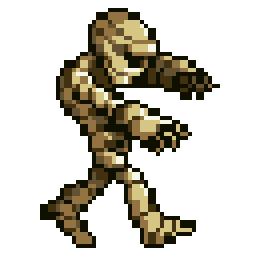

# Qué es Phaser

---

**Phaser** es un framework que nos permite construir juegos en HTML5 para equipos de escritorio y dispositivos móviles

Tiene una apasionada comunidad en el proceso de desarrollo, por lo que crece rápidamente

## Game

El objeto principal de Phaser es un objeto JavaScript llamado `Game`{.js}

Dentro de un *juego* (`Game`{.js}) hay *escenas* (`Scene`{.js}), y dentro de *escenas*, *objetos* (que son los que darán lógica y representación al juego) (`GameObject`{.js})


## Escenas en Phaser

Las `Scene`{.js}s de Phaser son la unidad mínima que maneja el framework para crear una escena de juego

Una `Scene`{.js} es un *objeto* JavaScript, con métodos y atributos ("propiedades") para su gestión

Phaser incluye un "scene manager" para gestionarlas

---

Por ejemplo, puede haber una escena para:

- el menú principal
- cada uno de los niveles
- el inventario

En teoría (aunque hay libertad), cada escena representa una lógica de interacción concreta

## Puede haber varias escenas activas

Phaser permite varias escenas *activas* y superpuestas

El orden de las escenas es importante, ya que el *scene manager* las actualiza y pinta en el orden en el que son añadidas

## Métodos básicos de una escena

El motor llama a estos métodos automáticamente:

- `init`{.js}: se ejecuta cuando se carga la escena. Aquí se pueden pasar datos entre escenas.
- `preload`{.js}: aquí hay que cargar los recursos antes de que sean usados.
- `create`{.js}: una vez que la clase está instanciada y el motor está a punto, se llama a este método para inicializar.
- `update(time, delta)`{.js}: se llama cada ciclo de juego, para modificar el estado.


---


Además, Phaser proporciona una serie de propiedades que podemos utilizar en nuestro juego, mayoritariamente, estas propiedades son formas de acceder a los subsistemas de Phaser

---

## Algunos subsistemas

Accesibles desde el objeto `Scene`{.js} con `scene.add`{.js}, `scene.load`{.js}...:

- `add`{.js}: La factoría de GameObject
- `cameras`{.js}: La cámara
- `input`{.js}: La entrada de Phaser
- `load`{.js}: el cargador de recursos
- `sound`{.js}: el sistema de sonido
- `scene`{.js}: el SceneManager
- `time`{.js}: el manager de tiempo
- `physics`{.js}: el sistema de físicas


# Crear un juego en Phaser

---

Para crear un juego, hay que crear una instancia de `Phaser.Game`{.js}:

```js
new Phaser.Game({
  type: Phaser.AUTO,
  width: 800,
  height: 400,
  scene: [ClaseEscenaInicial, ClaseEscenaNivel1]
})
```

Esto crea un `<canvas>`{.html} al final de la página

---

Si queremos usar nuestro propio `<canvas>`{.html}:

```html
<canvas id="juego"></canvas>
<script>
new Phaser.Game({
  type: Phaser.CANVAS,
  canvas: document.getElementById('juego'),
  width: 800,
  height: 400,
  scene: [ClaseEscenaInicial, ClaseEscenaNivel1]
})
</script>
```

---

Si queremos que el `<canvas>`{.html} tenga el foco, lo hacemos con [`focus()`{.js}](https://developer.mozilla.org/en-US/docs/Web/API/HTMLOrForeignElement/focus):

```html
<script>document.getElementById('juego').focus()</script>
```


---
  

## Ejemplo básico de un juego con Phaser


<https://cleongh.github.io/phasertemplate/>

<small>Código en <https://github.com/cleongh/phasertemplate></small>


---


## Un juego sencillo (y explicado) con Phaser


<https://cleongh.github.io/simplephasergame/>

<small>Código en <https://github.com/cleongh/simplephasergame></small>

---

## Documentación

- [Documentación de Phaser 3](https://photonstorm.github.io/phaser3-docs/index.html): Acceder desde la barra de menú en la parte superior
- [Nuevo sistema de documentación de Phaser](https://newdocs.phaser.io/docs/3.55.2/): Similar al anterior (en Beta)
- [Notes of Phaser 3](https://rexrainbow.github.io/phaser3-rex-notes/docs/site/index.html)


# Localización de los recursos

## Phaser y URLs

Por seguridad, los navegadores restringen mucho el acceso al disco

Por tanto, todos los recursos (imágenes y demás) tienen que ser cargados a través de la red

Para ello, tenemos que referencias los recursos con URLs


## URLs

En Internet (y en más sitios), cada elemento tiene un identificador único

---

Solemos referirnos a URLs (Uniform Resource Locator)


## URLs absolutas


- `http://www.ucm.es`
- `ftp://rediris.com/resourcea`
- `http://es.wikipedia.org/wiki`

La parte de antes de `:` es el *protocolo* (`http`, `ftp`...)


## URLs relativas

En una web, `/` es la raíz del sitio

El directorio especial `../` indica el directorio padre al del fichero actual.

El directorio `./` indica el directorio del fichero actual


- `./ejemplo/ruta`
- `../otro_hijo/ruta/musica.ogg`
- `/hijo_raiz_sitio/archivo.png`


---


Cuando servimos con `npx live-server`, se sirve *a partir del directorio en el que estamos, **nunca rutas por encima***

```bash
$ pwd
/home/usuario/misarchivos
$ cd docs
$ npx live-server # `localhost` equivale a `docs/`
```

En el caso anterior, no puedo ir a una URL `'../anterior.png'`{.js} que esté en `misarchivos`


# Carga de recursos en memoria

---

## Cargar

Se le añade una _key_ (clave o nombre) al recurso para poder identificarlo

```js
function preload() {
    this.load.image('phaser', 'sprites/phaser-dude.png');
    this.load.image('platform', 'sprites/platform.png');
}
```

---


Podemos cargar diferentes recursos como: imágenes, archivos JSON, atlas de texturas, video, sonido, tilemaps...


# Liberación de recursos

---

Si cambiamos de escena y la desactivamos, es muy probable que haya recursos que ya no utilizaremos nunca

En este caso podemos eliminarlos de la caché

```js
image1.destroy();
sound4.destroy();
```

<!-- Aqué el contexto es muy relevante puesto que no hemos explicado la caché
Hay que indicar que `cache` es una propiedad del objeto juego. -->

# Sprites en Phaser

---

Son las imágenes 2D que sirven para visualizar los objetos en un juego 2D.  En Phaser se instancian así:

```js
player = scene.add.sprite(100, 200, 'player');
```

---

{height=75%}

Hay que usar la clave que se le puso en la carga. El objeto, obviamente, *debe estar cargado memoria* con `scene.load`{.js}

# Spritesheet o atlas de sprites

---

{height=300px width=400px}

---

Sirven para optimizar recursos:

- Reduce el número de accesos al servidor (no es lo mismo traerse una imagen grande con muchas imágenes pequeñas que muchas imágenes pequeñas individuales)
- Es más eficiente en memoria

---

Sirve también para crear animaciones por frames


```js
function preload() {
    this.load.spritesheet(
      'keyspritesheet', 'keyspritesheet.png', { frameWidth: 64, frameHeight: 64 });
}

function create() {
    this.add.sprite(300, 200, 'keyspritesheet');

    this.scene.anims.create({
      key: 'standing_sprite',
      frames: this.scene.anims.generateFrameNumbers('keyspritesheet', { start: 0, end: 4 }),
      frameRate: 2,
      repeat: -1
    });
}
```

---



