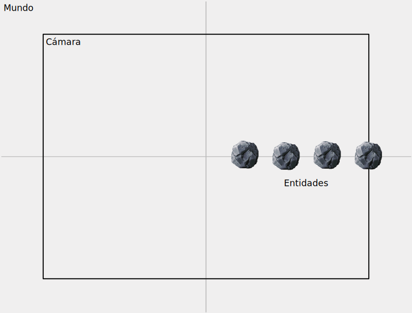
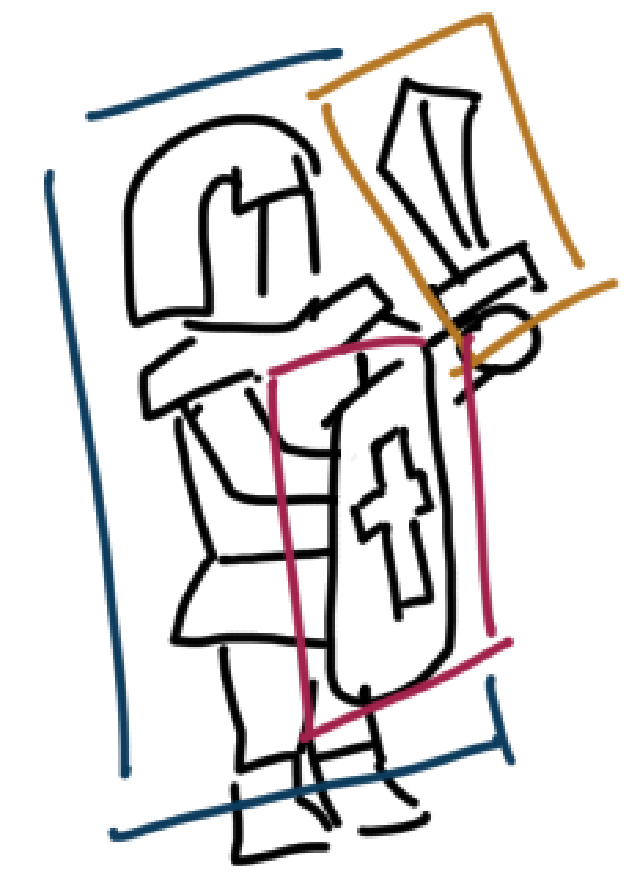

# Entidades `Image`{.js}

---

Las imágenes son las entidades visibles más simples de Phaser. Las entidades
son instancias de la clase [`Image`](https://photonstorm.github.io/phaser3-docs/Phaser.GameObjects.Image.html)

---


Su simplicidad las hace ligeras y eficientes en términos de memoria

Utilizamos imágenes cuando no necesitamos comportamientos complejos como físicas o animaciones por _keyframes_

---

Aun así, las imágenes se pueden mover, rotar, escalar o recortar

Esto las hace ideales para, por ejemplo, logos, imágenes de fondo, barras de carga, elementos de interfaz...

---

Una imagen se crea a través del método factoría [`add.image`{.js}](https://photonstorm.github.io/phaser3-docs/Phaser.GameObjects.GameObjectFactory.html) del objeto juego

Por ejemplo, como parte de la creación de una escena en el método `create`{.js}

---


## Atributos relevantes de las imágenes


Phaser tiene objetos para representar puntos o vectores centrados en (0, 0)

```js
var myPoint = new Phaser.Point(); // (0, 0)
var myPointXY = new Phaser.Point(10, 10); // (10, 10)
```

---


Las imágenes rendean texturas, y les podemos decir desde dónde queremos rendear la textura en relación al origen de la imagen, con `setOrigin`{.js}

---


También se puede elegir el *blending* con `blendMode` (¡mirad el API!)

---


## Métodos relevantes de las imágenes

---

Una imagen puede ser "recortada" con `setCrop`, de forma que sólo se vea un trozo de la misma

```js
image = scene.add.image(0, 0, 'phaser');
image.setCrop(0, 0, 10, 10);
```

---

Cuando la imagen se recorta, realmente no se pierde información

De hecho, el recorte se puede cambiar dinámicamente:

```js
// en la pestaña update
function update() {
    v += 0.1;
    image.setCrop(0, 0, v, v);
}
```


# La escena

---

En Phaser, la factoría de objetos se llama añadir (`add`{.js}) por una razón: **porque añadimos las nuevas entidades a la escena**


Para Phaser, la escena, representado por la clase [`Scene`](https://photonstorm.github.io/phaser3-docs/Phaser.Scene.html), es la **abstracción del lugar (un plano bidimensional) donde habitan las entidades**

---

{width=50%}

---


Miramos al mundo a través de [cámaras](https://photonstorm.github.io/phaser3-docs/Phaser.Cameras.Scene2D.Camera.html)

---


{width=50%}

---


Al iniciar, se crea una cámara, a la que podemos acceder a través del atributo [`cameras.main`{.js}](https://photonstorm.github.io/phaser3-docs/Phaser.Cameras.Scene2D.Camera.html) de la escena:

```js
// en la pestaña create, `this` es una `Scene`
var card = this.add.sprite(200, 200, 'card');
this.cameras.main.startFollow(card...);
```

---

Podemos cambiar el *viewport* de la cámara con `setViewport`{.js}:

```js
// `this` es una `Scene`
this.cameras.main.setViewport(200, 150, 400, 300);
```

---

## Pasar contenido entre escenas

Es posible (y normal) querer pasar contenido de una escena a otra (variables "globales" del juego, estado del jugador...)

---

Para eso, podemos pasarle un objeto JavaScript a la escena que iniciamos:

```js
this.scene.start('siguiente_escena', { monedas: 9 })
```

---

Este objeto le llegará a la siguiente escena a través del método `init`{.js}, al que Phaser llama automáticamente:

```js
class SiguienteEscena extends Phaser.Scene {
  init(datos) {
    this.monedas = datos.monedas
  }

  create() {
    this.player = new Player(this, this.monedas)
  }
}
``` 


# Entidades `Sprite`

---

La mayoría de las entidades visibles de un juego incorporan alguna animación y comportamiento

La clase [`Sprite`{.js}](https://photonstorm.github.io/phaser3-docs/Phaser.GameObjects.Sprite.html) representa estas "entidades animadas" y es el componente principal de los juegos con Phaser


---


Aunque podamos añadir _sprites_ al mundo utilizando el método factoría [`add.sprite`{.js}](https://photonstorm.github.io/phaser3-docs/Phaser.Scene.html), el sprite por defecto es tan simple que no se suele utilizar salvo en ocasiones donde no se requiere un comportamiento complejo

---

Este ejemplo es equivalente a añadir un _sprite_ con `add.sprite`{.js}:

```js
// En el método create, `this` es una `Scene`
create() {
  let sprite = new Phaser.GameObjects.Sprite(this, 0, 0, 'phaser');
  this.add.existing(sprite);
}
```

---

En la mayoría de los casos los _sprites_ tendrán un comportamiento avanzado: reaccionarán a los controles, ejecutarán algoritmos de IA, necesitarás métodos auxiliares, etc


Por ello, en lugar de usar instancias de las clase `Sprite`{.js}, es mejor que creemos clases adaptadas a nuestras necesidades y añadir instancias de estas clases

---


Para ello, nuestras clases _sprite_ deben heredar de [`Phaser.GameObjects.Sprite`](https://photonstorm.github.io/phaser3-docs/Phaser.GameObjects.Sprite.html)

---

Por ejemplo, considera el _sprite_ de un personaje que aparece aleatoriamente y cae


```js
class FallingMartian extends Phaser.GameObjects.Sprite {
  constructor(scene) {
    let x = Math.random() * 400;
    let y = Math.random() * 400;
    super(scene, x, y, 'phaser');
  }
}
```

---

Ahora podemos personalizar su comportamiento durante la fase de actualización de Phaser. Por ejemplo:


```js
class FallingMartian extends Phaser.GameObjects.Sprite {
  // en las entidades no es `update`, sino `preUpdate()`
  preUpdate () {
    this.y += 2;
  }
}
```

---

Es **muy importante**, para varias cosas, que el `preUpdate`{.js} de la clase hija llame al `preUpdate`{.js} de la clase padre (para que `Phaser.GameObjects.Sprite`{.js} sepa que hay que actualizarse):

```js
class FallingMartian extends Phaser.GameObjects.Sprite {
  preUpdate (t, dt) {
    super.preUpdate(t, dt)
    // lo lógica particular de `FallingMartian`, aquí
  }
}

```

---

Usando el ejemplo anterior para añadir un _sprite_, podemos añadir el personaje que cae:

```js
class Scene extends Phaser.Scene {
  create() {
    for (let i = 0; i < 10; i++) {
      let sprite = new FallingMartian(this, 0, 0);
      this.add.existing(sprite);
    }
  }
}
```

<small>Fijémonos en que también extendemos de la clase `Phaser.Scene`{.js} para hacer nuestra propia escena</small>

---

## Atributos relevantes de los sprites


Todos los `Sprite`{.js} son también `Image`{.js}. Por tanto, tienen todos los atributos de `Image`{.js}


Más adelante veremos más atributos de los `Sprite`{.js}, como `anims`{.js} o `body`{.js} (para físicas)

---


## Métodos relevantes relacionados con los sprites

---

A veces queremos asociar objetos con una jerarquía, con objetos *hijo* que dependan de objetos *padre*

{width=30%}


---

Un "hijo" es otra entidad cuyas propiedades van unidas y son relativas a las del padre

---

En Phaser 3 vamos a usar los `Container`{.js}, que son `GameObjects`{.js} que pueden contener otros objetos

---

Por ejemplo, si el `Container`{.js} `A`{.js} tiene un hijo `B`{.js} y movemos `A`{.js}, `B`{.js} se moverá junto a `A`{.js} automáticamente:


```js
// this es una `Scene`
create() {
    let a = new Phaser.GameObjects.Container(this, 10, 10); // Martian es un Sprite
    let b = new Martian('phaser');
    a.add(b); // hacemos que `b` sea hijo de `a`
    b.y = 10; // relativo a `a`
    this.add.existing(a);
}
```


# Transformaciones

---

Los objetos del juegos pueden alterar su posición, rotación y factor de escala


---

Se llama transformación a la **alteración de los atributos que controlan la posición, la rotación o el factor de escala de una entidad**

---


## Posicionamiento


Para alterar la posición de una entidad, recurrimos a los atributos [`x`{.js} e `y`{.js}](https://photonstorm.github.io/phaser3-docs/Phaser.GameObjects.Sprite.html)

---


En el caso de `Sprite`{.js}, es conveniente mover al elemento habiendo creado una clase que herede de `Sprite`{.js} y modificar `x`{.js} e `y`{.js} dentro de su `update`{.js}:


```js
class Martian extends Phaser.GameObjects.Sprite {
  constructor(scene, x, y) {
    super(this, x, y, 'martian');
    scene.add.existing(this);
  }
  preUpdate() {
    this.x += 1;
    this.y += 1;
  }
}
```

---

## Rotación


`angle`{.js} controla la rotación de un `Sprite`{.js}, en grados ($[-180...180]$)

También existe `rotation`{.js}, para hacer la rotación de radianes y es ligeramente más rápido

---


Valores negativos del ángulo son rotación antihoraria, y valores positivos, horaria

---

Cualquier valor $>360$ equivale a restar $360$ al ángulo (`angle = 450`{.js} es igual que `angle = 90`{.js})


```js
preUpdate () {
    // El marciano da vueltas sin parar
    this.angle++;
};
```

---


## Escalado


`width`{.js} y `height`{.js} controlan la anchura y altura, respectivamente

Con ellos se pueden escalar objetos


```js
resizeMe () {
    this.width = 3;
    this.height = 5;
};
```

---

Podemos hacer *mirroring*, con consiste en hacer una versión especular de la imagen, escalando de forma negativa

---

En el siguiente código, el `Sprite`{.js} se encoge tanto que se acaba dando la vuelta


```js
preUpdate() {
    this.width--;
};
```


# La jerarquía con contenedores

---


La escena contiene entidades (*game objects*) pero además, en Phaser, las entidades pueden contener otras entidades formando así una jerarquía en forma de árbol

---


La relación entre una entidad y sus entidades hijas es la de **pertenencia al sistema de coordenadas** (recordad `Container`)

---


Es decir, si la entidad `Moon`{.js} se añade a la entidad/container `Earth`{.js}, significa que `Moon`{.js} se encuentra en el sistema de coordenadas de `Earth`{.js}

---

Esto se puede lograr haciendo que `Moon`{.js} sea un `Container`{.js} que tenga una `Image`{.js} o `Sprite`{.js} con su aspecto y, además, tenga otros *game objects* que serían sus *hijos*:

```js
class Earth extends Phaser.GameObjects.Container {
  constructor(scene, x, y) {
    let aspecto = scene.add.sprite(0, 0, 'earth');
    super(scene, x, y, aspecto);
    scene.add.existing(this);
  }
}
```

---

Creamos también la tierra...

```js
class Moon extends Phaser.GameObjects.Sprite {
  constructor(scene, x, y) {
    super(scene, x, y, 'moon');
  }
}
```

---

... y lo añadimos:

```js
// this es una `Scene`
create() {
  this.earth = new Earth(this, 10, 10);
  let moon = new Moon(this, 10, 10);
  this.earth.add(this.moon);
}
```

---


Esto significa que al transformar `Earth`{.js} modificaremos `Moon`{.js} indirectamente

---


También significa que si transformaremos `Moon`{.js}, lo haremos respecto del sistema de coordenadas de `Earth`{.js} y no del mundo

---

Podéis ver un [ejemplo en Phaser 2](https://phaser.io/sandbox/edit/lWlACykr) en el que las entidades se agrupan según una jerarquía