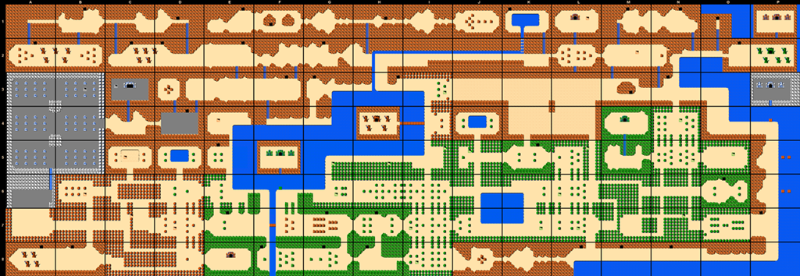
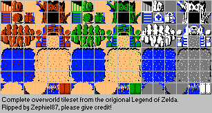
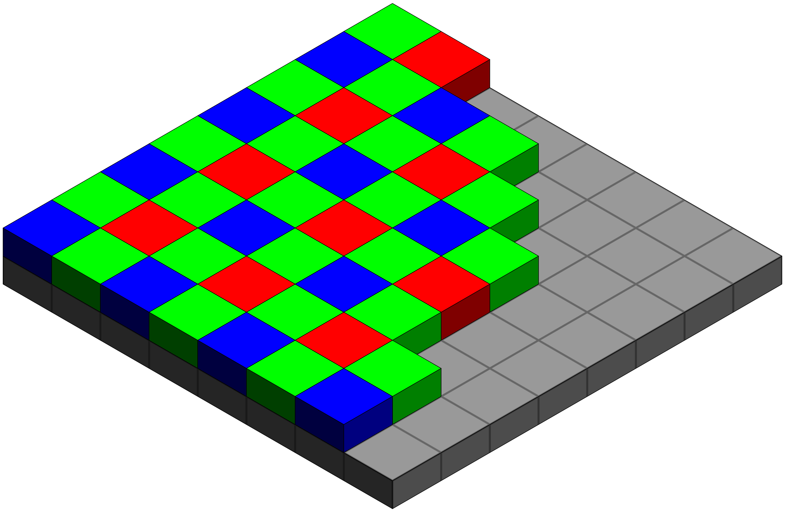
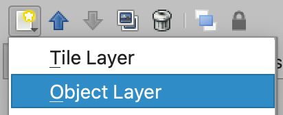
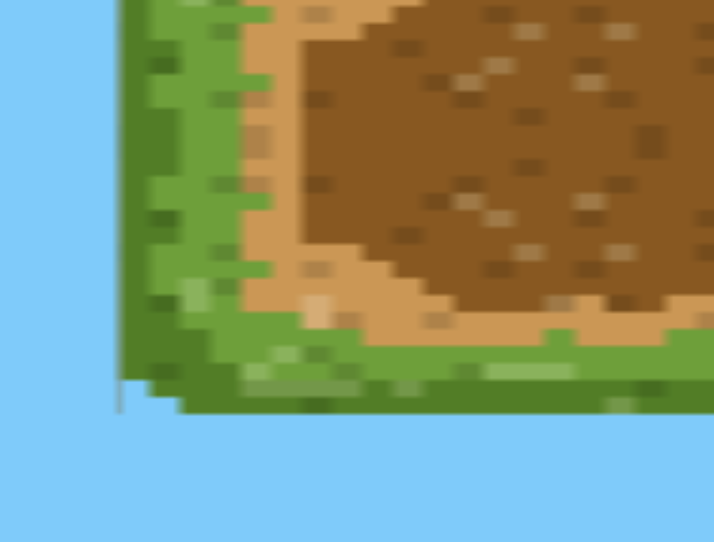
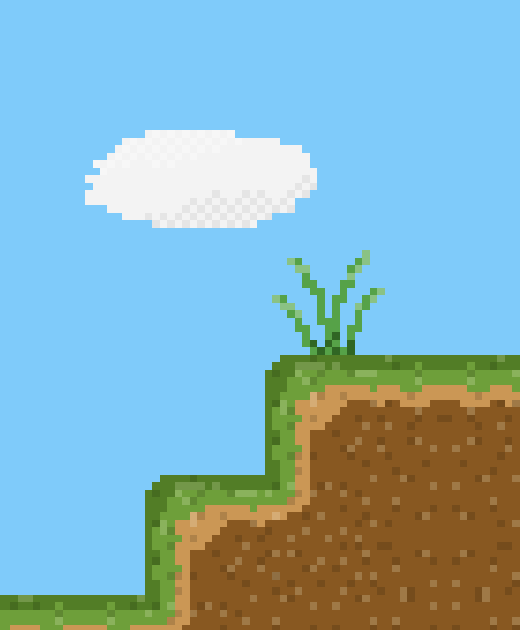
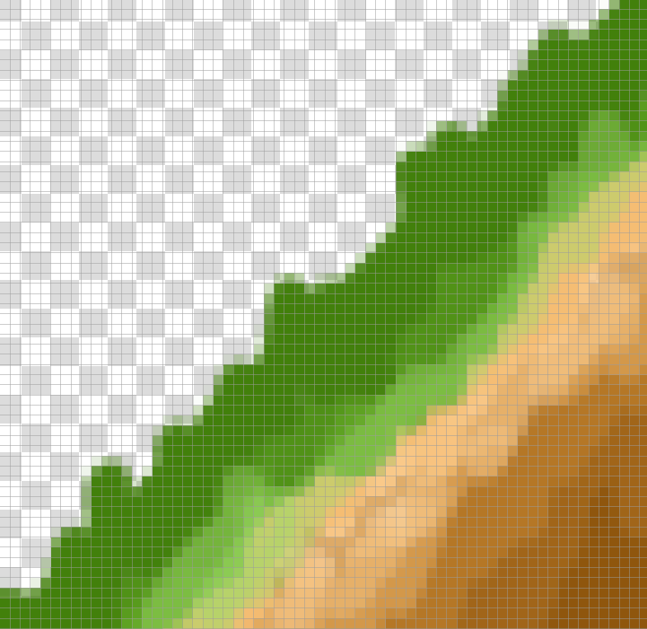

# Tiles

---

## Qué es un tile

Un *tile* (o baldosa) es un imagen, generalmente cuadrada y, generalmente, de tamaño fijo, que se usa para dibujar un elemento en un videojuego

---

Los tiles simplifican el desarrollo, ya que hacen que el mundo se considere **una matriz discreta**


---

Los tiles pueden ser usados para dibujar (por ejemplo, el mapa o el fondo) y también *para la lógica del juego* (como en los [roguelikes](https://es.wikipedia.org/wiki/Roguelike))

---

{weight=50%}

---

Cada *tile* es una imagen particular, independiente... ¡O no!


# Tile maps

## Qué es un tile map

Un **tile map** es una simplificación de un mundo en 2D en la que dicho mundo es
dividido en una cuadrícula de tamaño fijo (una matriz 2D)

---

En cada "celda" se pinta un tile, generalmente extraído de un *tile set*

<!-- Cada una de los rectángulos que forman la cuadrícula, en realidad representa un -->
<!-- fragmento o *frame* de un *spritesheet*. -->


## Partes de un mapa de tiles

Normalmente necesitamos está compuesto por:

- un fichero de datos con la definición del tile map
    - su tamaño (ancho y alto)
    - el tamaño de las casillas (tiles)
    - qué tile o imagen va en cada casilla
- una hoja de sprites con todos los tiles disponibles juntos 


## Ejemplo de tile map

{height=75%}
 


# Tile sets

---

Un tile set se suele implementar como un archivo de imagen en el que cada celda
representa un tile


---

## Ejemplo de tile set

{height=75%}

---

Cada celda del tile set representa una imagen *independiente*

Esto funciona bien para cosas aisladas: monedas, árboles, cajas...

---

Pero no funciona bien en **la playa**

---

## La playa

](http://opengameart.org/sites/default/files/styles/medium/public/preview_128.png)


---

Para evitar los "cortes", los tiles normalmente están creados para repetirse en la escena sin que se vean costuras, de forma que se pueden construir escenas muy complejas 

---

Se ocupa **mucha menos memoria** que dibujando la
escena en una imagen (se carga una, se usa muchas veces)

---

## ¿Por qué es más eficiente?

- Escena de 4096 $\times$ 1024, tiles de 64 $\times$ 64
    - Sin tile map: 4096 $\times$ 1024 $\times$ 4B de color = **16.7 MB**
    - Con tile map: tile map de 64 $\times$ 16, tile set de 1024 $\times$ 1024 con 16 $\times$ 16 tiles = 256 tiles
        - Tamaño del tile map = 1024 B
        - Tamaño del tile set = 1024 $\times$ 1024 $\times$ 4 = 4 MB
        - Tamaño total = **4.01 MB**


---

## Otras ventajas:

- Al tener todos los tiles en la misma hoja de scripts sólo necesitamos una llamada a pintado para pintar todo el escenario
- Cuando cargamos desde Internet, es fundamental reducir los tiempos de carga
- Dibujar la escena es más sencillo, sobre todo con un editor de tiles
- Podemos reutilizar tiles en diferentes escenarios.

---

La desventaja es que los gráficos del escenario **están repetidos**

---

(Pero periódicamente se pone de moda)


# Editores de tiles


## ¿Por qué usarlos?

Nos simplifican la edición del tile map enormemente

---

Crear el tile map a mano es mucho mas complejo y propenso a errores

---


## Tiled

[Tiled](http://www.mapeditor.org/) es un editor de niveles 2D que ayuda a desarrollar escenarios para juegos

---

Puede exportar a diferentes formatos, entre ellos el formato JSON que usa Phaser

---

Tiene soporte para diferentes capas (**layers**) e incluso para añadir una capa
especial de objetos con la ubicación de los objetos en el mapa


---


---


## Partes de la interfaz de Tiled

- Menu contextual (izquierda)
- Tilesets (derecha abajo)
- Layers (derecha arriba)
- Herramientas (parte superior)
- Zona de edición (centro)


---

## Crear un nuevo proyecto

Creamos un nuevo proyecto en `Archivo` $\rightarrow$ `Nuevo` y aparecerá la ventana de creación del tile map

---

{width=40%}

---

Aquí establecemos:

- El tamaño del patrón (tile) y el número de patrones que tendrá el nivel
- Si queremos vista ortogonal o isométrica
- Marcamos como *Base64 (uncompressed)* sin comprimir el formato de la capa de patrones
- *No* creamos un mapa infinito


---


## Proyecciones ortogonal e isométrica

---

- Base ortogonal es la tradicional en los juegos 2D (visto "desde arriba")
- Base isométrica es una vista ortogonal especial que simula el 3D sin corrección de perspectiva
    - Todos los ejes forman un ángulo de 120º. El dibujo se gira 45º para poner la esquina del escenario frente al espectador
    - La cámara se situaría en la esquina superior 

---

{width=75%}

---


{width=60%}


---

{height=75%}


---

## Usar tilesets

---

{height=60%}

---

## Importante

**El nombre que le demos al tile set** se usará posteriormente para cargar el spritesheet con los tiles en Phaser

---

## Añadir una capa


Podemos añadir nuevas capas

Las capas son importantes para diferenciar los objetos del fondo con los objetos del suelo

---

{height=75%}

---

## Exportar

Los mapas se guardan con la extensión `.tmx`

Para usar el mapa que hemos creado, *lo tenemos que exportar a JSON* (`.json`)

<small>Hay más formatos, pero lo mejor opción es JSON</small>

---


---


# Tile maps en Phaser

---

## Phaser 3.50

A partir de Phaser 3.50.0 [cambia la API de los mapas](https://newdocs.phaser.io/docs/3.55.2/Phaser.Tilemaps.Tilemap), y se hace algo mejor (y más potente)

Tened cuidado con las versiones en la documentación disponible

---

## Cargar el tile map

Para cargar el fichero de descripción del tile map, usamos `tilemapTiledJSON()`{.js} en `preload()`{.js}


```js
this.load.tilemapTiledJSON('tilemap', 'tilemap.json');
```

---

- El primer parámetro es el nombre del recurso en la cache
- El segundo es el fichero JSON que contiene la descripción del mapa

---

Esto sólo carga el archivo del tilemap, no *crea* un tilemap en el juego

---


Para cargar el atlas de patrones usaremos la carga de imagenes normal: `load.image`{.js}

```js
this.load.image('patronesTilemap', 'images/patrones.png');
```

---

## Crear el tile map

Para crear un tilemap usamos el recurso cargado en la cache como *tilemap*, en el método `create()`{.js} (**no en `preload()`{.js}**)

```js
this.map = this.make.tilemap({ 
  key: 'tilemap', 
  tileWidth: 64, 
  tileHeight: 64 
});
```

---

Una vez creado le asignamos la textura donde tenemos los tiles

```js
const tileset1 = this.map.addTilesetImage('patrones', 'patronesTilemap');
```

---

La textura debe estar previamente cargada y el nombre de la textura en el mapa de tiles debe ser conocido

---

Un mapa de tiles puede tener más de una textura asociada, por lo que hay que asignar el nombre usado en el editor al asignar al tileset al nombre de la textura cargada en la cache

---

Es decir, `'patrones'`{.js} y `'patronesFondo'`{.js} son nombres de atlas en Tiled---los que están en las pestañas:

```js
const tileset1 = this.map.addTilesetImage('patrones', 'idImagen');
const tileset2 = this.map.addTilesetImage('patronesFondo', 'idImagen2');
```

---

## Crear las diferentes capas

Por último, es necesario crear las capas para que el mapa se visualice.

Como hemos visto, en el editor de tiles podemos crear diferentes capas o *layers*

Las capas tienen entidad única y se pueden manejar independientemente (por ejemplo, para colisiones)

---

Una capa permite diferenciar los objetos del fondo con los objetos de frente o tener diferentes fondos

---

Si hay capas creadas en el editor, podemos asignar estas capas (*layers*) en Phaser:

```js
// tileset1, tileset2 han sido creados con `addTilesetImage`
this.backgroundLayer = 
  this.map.createLayer('BackgroundLayer', 
                             [tileset1, tileset2]);
// funciona con y sin array
this.groundLayer = 
  this.map.createLayer('GroundLayer'
                             , tileset1);
this.foreground = 
  this.map.createLayer('Foreground'
                             , [tileset1, tileset2]);
```

---

## Capas de objetos

---

Además de los tiles que forman el escenario, también podemos poner a nuestros personajes en Tiled

---



---

Después, desde Phaser, **no** crearemos capas Phaser desde las capas de objetos de Tiled, sino que crearemos `Sprite`{.js}s a partir de los objetos de la capa

---

Lo haremos con [`createFromObjects`{.js}](https://photonstorm.github.io/phaser3-docs/Phaser.Tilemaps.Tilemap.html#createFromObjects__anchor):

```js
// con el ID de objeto
conId1 = map.createFromObjects('nombreDeCapaObjetosEnTiled', {gid: 1})

// o con el nombre del objeto (`name` en Tiled)
players = map.createFromObjects('nombreDeCapaObjetosEnTiled', {name: 'player'})

// cambiar las propiedades de player después
players.map(p => p.vida = 10)
```

Phaser colocará estos `Sprite`{.js}s en el lugar apropiado

---

Si no quiero `Sprite`{.js}s, podemos decirle el tipo (que tiene que heredar de `GameObject`{.js}):

```js
createFromObjects(layerName, {
  name: 'heart-container',
  classType: HeartContainer
})
```

---

## Crear los objetos analizando el mapa

Para no usar `createFromObjects()`{.js}, también podemos examinar la capa a mano y crear los objetos directamente

**Este código se creó para Phaser < 3.50, no suele ser necesario con las últimas versiones**

---

Los objetos de una capa de _objetos_ los podemos encontrar en:

```js
this.mapa.getObjectLayer('capaObjetos').objects
```

---

Así, podemos iterar sobre ellos:

```js
// En Tiled tiene que haber una capa de objetos llamada `capaObjetos`
for (const objeto of scene.mapa.getObjectLayer('capaObjetos').objects) {
    // `objeto.name` u `objeto.type` nos llegan de las propiedades del
    // objeto en Tiled
    if (objeto.type === 'player') {
      new Player(scene, objeto.x, objeto.y)
    }
}
```

---

Además, podemos examinar las propiedades que hayamos añadido al objeto en Tiled:

```js
for (const objeto of scene.mapa.getObjectLayer('capaObjetos').objects) {
    if (objeto.name === 'player') {
      const jugador = new Player(scene, objeto.x, objeto.y)
      for (const { name, value } of objeto.properties) {
        jugador[name] = value 
      }
    }
}
```

---

Una función para cargar:

```js
function cargar(mapa, capa, tipo, callback) {
  const objetos = mapa.getObjectLayer(capa).objects.filter(x => x.type === tipo)
  for (const objeto of objetos) {
    const props = {}
    if (objeto.properties) {
      for (const { name, value } of objeto.properties) {
        props[name] = value
      }
    }
    callback({ x: objeto.x, y: objeto.y, props })
  }
}
```

---

Y, para usarla:

```js
cargar(this.mapa, 'objetos', 'player', ({ x, y, props }) => {
  this.player = new Player(this, x, y)
  this.player.vida = props.vida
})
```


# Escala

---

Escalar un mapa, o cualquier otra cosa, es posible, pero es mucho más fácil diseñar todo a una escala dada

---

Es decir, que los assets estén *dibujados* con escalas relativas, sin que haya que redimensionar algunos elementos para que encaje

---

Sin embargo, el tamaño de página, dispositivo y pantalla en el que se ejecutará el juego puede cambiar, por lo que reescalar puede ser necesario

---

Phaser 3 lo pone muy fácil:

```js
const config = {
    width: 1024,
    height: 768,
    scale: {
      mode: Phaser.Scale.FIT,
      // mode: Phaser.Scale.SMOOTH,
      autoCenter: Phaser.Scale.CENTER_BOTH
    }
}
```

<small>Cambiando `width`{.js} y `height`{.js} y el tamaño del canvas, se ajusta el tamaño del juego</small>

---

Pero este escalado hará que los bordes de los píxeles pequeños, al agrandar, se vean difuminados (por el algoritmo de escalado)


---

{width=60%}


---

Afortunadamente, Phaser sabe que adoramos el pixelart:

```js
const config = {
  pixelArt: true
}
```

---

{width=40%}


# Colisiones con mapas

---

Una parte importante, una vez que tenemos el mapa, es que los tiles tengan *propiedades físicas*

---

## Colisión por propiedades

Por ejemplo, dada una capa (`layer`{.js}), podemos hacer que todos aquellos tiles que tengan cierta propiedad, colisionen:

```js
suelo.setCollisionByProperty({ colisiona: true });
```

---

## Colisión por inclusión

O podemos hacer que los tiles con *id* en un rango concreto, colisionen:

```js
// así colisionarán todos los tiles de la capa 
// asumiendo que no hay id > 99
suelo.foreground.setCollisionBetween(0, 999);
```

<small>En efecto, cada tipo de tile tiene un *id*</small>

---

## Colisión por exclusión

```js
// `true` es que activa la colisión
layer.setCollisionByExclusion([93, 94, 95, 96], true);
```

---

## Colisiones de `Sprites`{.js} con capas

Aunque hayamos activado las colisiones para los tiles, *tenemos que activar `colliders` para cada entidad que lo necesite*:


```js
this.physics.add.collider(player, layer);
```

---

También podemos eliminar un `collider` antes creado

Por ejemplo, para hacer que se puedan cruzar zonas que antes no se podía:

```js
this.collider = this.physics.add.collider(
                  this.player,
                  room.foreground);
// y, después
this.collider.destroy();
```

---

Los ejemplos anteriores son para *Arcade*

Para que funcione la colisión con *Matter.js*, hay que poner **también**:

```js
this.matter.world.convertTilemapLayer(suelo);
```

---


## Tiles que no son cuadrados

---

Hasta ahora hemos asumido que los tiles tienen que ser cuadrados

---

Pero con *Matter.js* es posible conseguir que las físicas de un tile tenga otra forma

---

{width=50%}

---


---

Vamos a las propiedades del tileset , y luego a editar las colisiones 

---

{width=40%}

---

Cuando hagáis esto, es recomendable que se lo pongáis fácil a *Matter.js* haciendo los polígonos **convexos**

Si el polígono es cóncavo, tendrá que subdividir el polígono en varios convexos, o usar una malla que tenga más coste (casco convexo)
